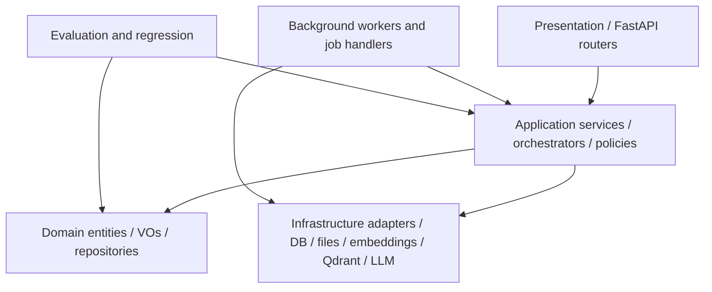

# Backend Architecture

This guide documents the current backend implementation of Atenex Nova as it exists in the repository today.

## Scope

The backend is a modular monolith built around FastAPI, SQLAlchemy, and worker-driven background jobs. It follows the product contract in [docs/baseline.md](baseline.md) and the current implementation gap inventory in [docs/final-gap-inventory.md](final-gap-inventory.md). The [docs/plan_restante.md](plan_restante.md) file is retained only as historical context.

## Entry Points

- API app factory: [backend/atenex_nova/main.py](../backend/atenex_nova/main.py)
- Dependency wiring: [backend/atenex_nova/dependencies.py](../backend/atenex_nova/dependencies.py)
- Worker process: [backend/atenex_nova/workers/main.py](../backend/atenex_nova/workers/main.py)
- Job runner: [backend/atenex_nova/workers/runner.py](../backend/atenex_nova/workers/runner.py)

## Layer Map

### Presentation

The API routers live under [backend/atenex_nova/presentation/api/routers](../backend/atenex_nova/presentation/api/routers). The current public surface is:

- `health`
- `collections`
- `documents`
- `queries`
- `answers`
- `jobs`
- `observability`
- `evaluation`

Routers should call application services or repositories via dependencies. They should not reach directly into unrelated infrastructure.

### Application

Application services coordinate use cases and job orchestration:

- collection management
- document registration, import, and rebuild
- query search and answer generation
- evaluation runs
- job lifecycle operations

The current code uses thin service classes rather than a large orchestration framework. That keeps the flow easy to trace, but the orchestration boundary still matters: presentation should remain a shell around use cases, not the owner of business logic.

### Domain

The domain layer models the repository as a memory system, not a generic CRUD app. Important primitives include:

- `Collection`
- `Document`
- `DocumentNode`
- `Chunk`
- `Proposition`
- `SummaryNode`
- `RelationEdge`
- `Query`
- `Answer`
- `Citation`
- `Job`

The state enums in [backend/atenex_nova/domain/value_objects/identifiers.py](../backend/atenex_nova/domain/value_objects/identifiers.py) define the lifecycle of documents, jobs, queries, answer plans, node types, proposition kinds, and relation types.

### Infrastructure

Current infrastructure adapters include:

- SQL repositories for documents, chunks, propositions, summaries, jobs, answers, citations, queries, pipeline audit, and relations
- blob storage in [backend/atenex_nova/infrastructure/files/blob_store.py](../backend/atenex_nova/infrastructure/files/blob_store.py)
- Docling parsing
- EmbeddingGemma embeddings
- Qdrant hybrid storage
- ColPali-style visual page indexing
- LLM gateway / runtime adapters

The repository uses SQLAlchemy async sessions and a single DB session factory, with tables created on startup by the FastAPI lifespan hook.

### Workers

Workers run as a separate process and poll pending jobs. The worker process registers handlers for ingestion, memory building, memory enrichment, rebuild, and visual indexing jobs. See [docs/jobs-and-workers.md](jobs-and-workers.md) for the full lifecycle.

### Evaluation

The evaluation layer exists as a separate concern and is surfaced through `/evaluation` endpoints. It is intended for datasets, runs, and regression-oriented scoring rather than for live user traffic.

## Runtime Flow

### 1. API startup

On startup, [main.py](../backend/atenex_nova/main.py) configures logging, creates tables, and mounts CORS plus routers.

### 2. Collection and document registration

The `collections` router creates collections and handles document upload/import. Uploads are stored under `backend/storage/uploads/{collection_id}/{document_id}/{filename}` and document metadata is persisted through the document service.

### 3. Ingestion pipeline

Document ingestion is job-driven and currently follows this chain:

1. `PARSE_DOCUMENT`
2. `NORMALIZE_DOCUMENT`
3. `SEGMENT_DOCUMENT`
4. `EMBED_DOCUMENT`
5. enrichment jobs: propositions, summaries, graph, visual pages

The parse handler resolves both current and legacy relative source paths so older records still work when the worker CWD changes.

### 4. Query and answer flow

The query subsystem first classifies the request, then chooses a routing mode, then assembles evidence from multiple sources:

- chunks
- propositions
- summaries
- visual pages when relevant

Answer generation then selects a synthesis plan, builds a prompt, calls the local LLM adapter, binds citations, computes grounding, and persists the answer.

### 5. Strict runtime mode

The backend now supports strict runtime guards through settings:

- strict mode defaults to enabled in `prod` profile unless explicitly overridden
- per-subsystem requirements are configurable for embeddings, LLM, Qdrant, and visual retrieval
- retrieval can enforce a minimum number of evidence items
- answering can enforce a minimum grounding score

In strict mode, missing evidence, empty LLM outputs, or unavailable required services are surfaced as typed errors and returned by the query endpoints as explicit `422` or `503` responses.

## Data Model Notes

- Document lifecycle is stateful: `registered -> parsed -> normalized -> segmented -> embedded -> indexed -> ready`
- Job lifecycle is stateful: `pending -> running -> succeeded / failed / cancelled`
- Query mode and answer plan are persisted so the UI can show the actual route taken
- Qdrant collections are namespaced by collection id for chunks, propositions, summaries, and visual pages

## Current Implementation Notes

- The graph builder currently creates relation edges with simple heuristic rules over neighboring propositions.
- The visual indexing path groups nodes by page and sends a page payload to the ColPali adapter.
- The worker runner uses polling and status updates in the database; there is no external queue service in the current repo.
- Pipeline audit records are used throughout ingestion and enrichment to keep the processing trail visible.

## Related Docs

- [docs/baseline.md](baseline.md)
- [docs/final-gap-inventory.md](final-gap-inventory.md)
- [docs/plan_restante.md](plan_restante.md)
- [docs/jobs-and-workers.md](jobs-and-workers.md)
- [docs/api-endpoints.md](api-endpoints.md)
