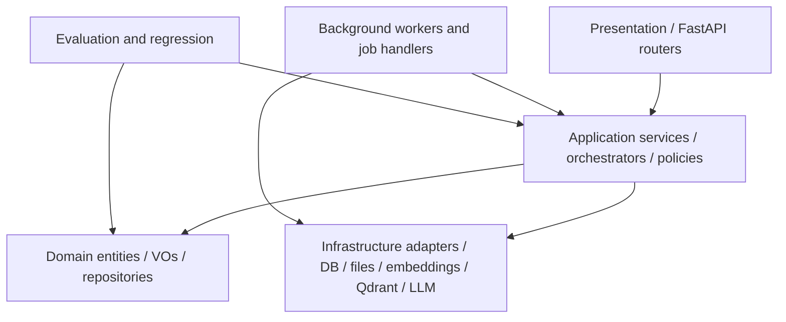

# Backend Architecture

Estado: **Implemented** para Repo Context y para el RAG documental descrito abajo.
Repo Context fue **Verified** en la ejecución del 2026-07-31. Las correcciones del
flujo documental están **Verified** en pruebas focalizadas del checkout; un rebuild y
una revalidación de release con servicios vivos permanecen **Planned**.

This guide documents the current backend implementation of Atenex Nova as it exists
in the repository today. The product now has two explicitly separate bounded
contexts:

- `repo_context`: the primary product direction, with its own domain, application,
  infrastructure and presentation packages.
- the existing document-memory/RAG packages: maintained legacy functionality.

The implemented Repo Context architecture is documented in
[architecture-repo-context.md](architecture-repo-context.md). Its sidecar database
must not reuse the document RAG tables or entities.

## Scope

The legacy backend is a modular monolith built around FastAPI, SQLAlchemy, and
worker-driven background jobs. It follows the product contract in
[docs/baseline.md](baseline.md). Current documentary-RAG evidence is in
[auditoria-rag-respuestas-sota-2026-08-02.md](auditoria-rag-respuestas-sota-2026-08-02.md);
the earlier audit remains historical through
[auditoria-completa.md](auditoria-completa.md).

## Entry Points

- API app factory: [backend/atenex_nova/main.py](../backend/atenex_nova/main.py)
- Dependency wiring: [backend/atenex_nova/dependencies.py](../backend/atenex_nova/dependencies.py)
- Worker process: [backend/atenex_nova/workers/main.py](../backend/atenex_nova/workers/main.py)
- Job runner: [backend/atenex_nova/workers/runner.py](../backend/atenex_nova/workers/runner.py)

## Layer Map

```mermaid
flowchart TB
  presentation[Presentation / FastAPI routers]
  application[Application services / orchestrators / policies]
  domain[Domain entities / VOs / repositories]
  infrastructure[Infrastructure adapters / DB / files / embeddings / Qdrant / LLM]
  workers[Background workers and job handlers]
  evaluation[Evaluation and regression]

  presentation --> application
  application --> domain
  application --> infrastructure
  workers --> application
  workers --> infrastructure
  evaluation --> application
  evaluation --> domain
```

### Presentation

The API routers live under [backend/atenex_nova/presentation/api/routers](../backend/atenex_nova/presentation/api/routers). The current public surface is:

- `health`
- `collections`
- `documents`
- `queries`
- `answers`
- `jobs`
- `observability`
- `evaluation`

Routers should call application services or repositories via dependencies. They should not reach directly into unrelated infrastructure.

### Application

Application services coordinate use cases and job orchestration:

- collection management
- document registration, import, and rebuild
- query search and answer generation
- evaluation runs
- job lifecycle operations

The current code uses thin service classes rather than a large orchestration framework. That keeps the flow easy to trace, but the orchestration boundary still matters: presentation should remain a shell around use cases, not the owner of business logic.

### Domain

The domain layer models the repository as a memory system, not a generic CRUD app. Important primitives include:

- `Collection`
- `Document`
- `DocumentNode`
- `Chunk`
- `Proposition`
- `SummaryNode`
- `RelationEdge`
- `Query`
- `Answer`
- `Citation`
- `Job`

The state enums in [backend/atenex_nova/domain/value_objects/identifiers.py](../backend/atenex_nova/domain/value_objects/identifiers.py) define the lifecycle of documents, jobs, queries, answer plans, node types, proposition kinds, and relation types.

### Infrastructure

Current infrastructure adapters include:

- SQL repositories for documents, chunks, propositions, summaries, jobs, answers, citations, queries, pipeline audit, and relations
- blob storage in [backend/atenex_nova/infrastructure/files/blob_store.py](../backend/atenex_nova/infrastructure/files/blob_store.py)
- Docling parsing
- EmbeddingGemma embeddings
- Qdrant hybrid storage
- ColPali-style visual page indexing
- LLM gateway / runtime adapters

The answer-facing Ollama adapter requests `think=false`. Current Gemma 4 builds
otherwise spend the generation budget on hidden reasoning before emitting visible
answer text; retrieval evidence and answer verification remain the responsibility
of Atenex's application layer. `QueryRoutingPolicy` matches heuristic cues as whole
words or phrases before it selects a retrieval strategy. An explicit collection
language profile overrides query-language detection. Spanish lexical tokens fold
vowel accents for queries written without diacritics while preserving `ñ`.

The repository uses SQLAlchemy async sessions and a single DB session factory, with tables created on startup by the FastAPI lifespan hook.

### Workers

Workers run as a separate process and poll pending jobs. The worker process registers handlers for ingestion, memory building, memory enrichment, rebuild, and visual indexing jobs. See [docs/jobs-and-workers.md](jobs-and-workers.md) for the full lifecycle.

### Evaluation

The evaluation layer exists as a separate concern and is surfaced through `/evaluation` endpoints. It is intended for datasets, runs, and regression-oriented scoring rather than for live user traffic.

## Runtime Flow

### 1. API startup

On startup, [main.py](../backend/atenex_nova/main.py) configures logging, creates tables, and mounts CORS plus routers.

### 2. Collection and document registration

The `collections` router creates collections and handles document upload/import. Uploads are stored under `backend/storage/uploads/{collection_id}/{document_id}/{filename}` and document metadata is persisted through the document service.

Folder imports pass through a corpus policy before hashing or registration. The
policy uses a content-format allowlist, an explicit size bound and exclusions for
administrative metadata, VCS/build/dependency paths, database/index/archive artifacts
and symlinks that leave the selected root. Import sessions persist accepted and
skipped counts plus the reason for each exclusion.

### 3. Ingestion pipeline

Document ingestion is job-driven and currently follows this chain:

1. `PARSE_DOCUMENT`
2. `NORMALIZE_DOCUMENT`
3. `SEGMENT_DOCUMENT`
4. `EMBED_DOCUMENT`
5. enrichment jobs: propositions, summaries, graph, visual pages

The parse handler resolves both current and legacy relative source paths so older
records still work when the worker CWD changes. For transcript-like text, the parser
separates envelope metadata from transcript content, recognizes SRT/inline timestamps
and propagates source offsets, temporal bounds and structural role into nodes. These
fields travel as metadata and source spans; they do not dominate embedding text.

Segmentation uses complete structural units when they fit and subdivides an oversized
unit at semantic boundaries when necessary. The current contract is a hard maximum
of 800 estimated tokens with 80 tokens of overlap. Chunk metadata retains node IDs,
heading path, pages and source spans. Embedding inputs use distinct query and document
prefixes and are bound to the `emb-v2` compatibility fingerprint.

### 4. Query and answer flow

The query subsystem first classifies the request, then chooses a routing mode, then assembles evidence from multiple sources:

- chunks
- propositions
- summaries
- visual pages when relevant

Answer generation then selects a synthesis plan, builds a prompt, calls the local LLM adapter, binds citations, computes grounding, and persists the answer.

For the maintained documentary RAG path:

- a collection publication policy fails closed while a rebuild is active, while any
  document is transitional, when the collection is empty, or when no document is
  `READY`; terminal `FAILED` documents remain an explicit corpus gap;
- every external/index hit is checked against the ready SQL inventory and rehydrated
  from canonical chunk, proposition, summary, node and document rows. Unknown IDs,
  wrong ownership and incompatible embedding fingerprints are discarded;
- repositories page through the complete collection instead of imposing a hidden
  50-document discovery limit;
- an ambiguous follow-up may incorporate a bounded recent conversation into a
  transient retrieval query while the persisted user question remains unchanged;
- `multi_hop`, `argumentative` and `global` routes can produce up to three
  deterministic facet variants in addition to the original query. Conservative
  normalization includes the benchmarked `eutanacia` → `eutanasia` correction; RRF
  fuses variants and records their provenance;
- a question mark alone does not imply `multi_hop`, and local/exact routes retain a
  direct-answer plan even when a summary appears in the evidence pack;
- transcript envelopes are removed and long chunks expose a query-centered excerpt;
  if Qdrant sparse retrieval is empty, chunks retain a local BM25 signal;
- full `metadata.source_text` remains available for span binding but is excluded
  from prompt token estimation because only the compact snippet is formatted;
- graph edges are diversified and may explain traversal, but are not accepted as
  documentary citations;
- citation audit expands grouped markers, records invalid/non-citable/unresolved
  indices, and never appends synthetic markers after binding;
- complex plans group evidence by document into bounded map calls and reduce their
  memos into one answer while preserving the original global evidence indices;
- claim audit segments the answer, checks citation coverage and lexical support for
  every material claim, and records unsupported/weak claims in the trace;
- the LLM verifier may lower the deterministic verdict or grounding score, never
  raise it. A clearly English draft for an `es` query triggers one repair attempt;
  persistent failure returns a Spanish unverified fallback rather than a translated
  answer;
- public API DTOs remove full source text from evidence metadata and expose its
  character count instead; full prompts are persisted only when configured for
  audit.

### 5. Strict runtime mode

The backend now supports strict runtime guards through settings:

- strict mode defaults to enabled in `prod` profile unless explicitly overridden
- per-subsystem requirements are configurable for embeddings, LLM, Qdrant, and visual retrieval
- retrieval can enforce a minimum number of evidence items
- answering can enforce a minimum grounding score

In strict mode, missing evidence, empty LLM outputs, or unavailable required services are surfaced as typed errors and returned by the query endpoints as explicit `422` or `503` responses.

## Data Model Notes

- Document lifecycle is stateful: `registered -> parsed -> normalized -> segmented -> embedded -> indexed -> ready`. A readiness service now requires chunk, proposition and summary artifacts/embeddings, successful graph work and visual work when applicable; it demotes an incomplete `ready` document and schedules a bounded repair. This is a temporal barrier over jobs and artifacts. A shared `generation_id` plus atomic activation across every store remains **Planned**.
- Dense vectors are quantized via `VectorQuantizerPort` for compatibility/fallback,
  while named dense vectors in Qdrant are the primary online retrieval path when the
  service is available. Startup validates dense name/dimension and sparse schema;
  incompatible collections require a rebuild. The PurePy fallback skips legacy
  profiles whose fingerprint is not `emb-v2` and refuses exhaustive layers above its
  configured safe cardinality. TurboVec/sublinear local generation is not a
  **Verified** live claim (see [docs/turboquant-integration.md](turboquant-integration.md)).
- Job lifecycle is stateful: `pending -> running -> succeeded / failed / cancelled`
- Query mode and answer plan are persisted so the UI can show the actual route taken
- The code defines Qdrant namespaces for chunks, propositions, summaries, collection
  memory and visual pages. Schema guards prove compatibility, not layer completeness;
  a clean live rebuild and cross-store generation reconciler remain **Planned**.
- Reparse and rebuild cleanup captures derived IDs before relational deletion and
  removes the corresponding candidate vectors, quantized rows, Qdrant points,
  incoming/outgoing edges and visual assets. This cleanup is idempotent, but it is
  not a substitute for staged `generation_id` activation.

## Current Implementation Notes

- The graph builder currently creates relation edges with simple heuristic rules over neighboring propositions and keyword matches inside one document; a real corpus-wide concept graph remains **Planned**.
- Summary generation is extractive but idempotent: one section summary per chunk and
  one document summary carry explicit child provenance. `BUILD_COLLECTION_MEMORY` is
  an explicit ordered hierarchical reduction over ready document summaries and
  produces exactly one collection summary plus its embedding. Topic clusters,
  abstractive claim summaries and contradiction modeling remain **Planned**.
- `hierarchical_synthesis`, `global_synthesis` and argument synthesis execute bounded
  map-reduce. Iterative retrieval after measuring missing facets remains **Planned**.
- Context budgets now vary by route and the pack applies relevance, coverage,
  per-document caps and citability. Conversation context and deterministic facet
  expansion are implemented; generative rewrite and a calibrated neural reranker
  remain **Planned**.
- The visual indexing path groups nodes by page and sends a page payload to the ColPali adapter.
- The worker runner uses polling and status updates in the database; there is no external queue service in the current repo.
- Pipeline audit records are used throughout ingestion and enrichment to keep the processing trail visible.

## Related Docs

- [docs/baseline.md](baseline.md)
- [docs/auditoria-completa.md](auditoria-completa.md)
- [docs/turboquant-integration.md](turboquant-integration.md)
- [docs/jobs-and-workers.md](jobs-and-workers.md)
- [docs/api-endpoints.md](api-endpoints.md)
- [docs/auditoria-rag-respuestas-sota-2026-08-02.md](auditoria-rag-respuestas-sota-2026-08-02.md)
- [docs/plan-rag-sintesis-corpus.md](plan-rag-sintesis-corpus.md)
