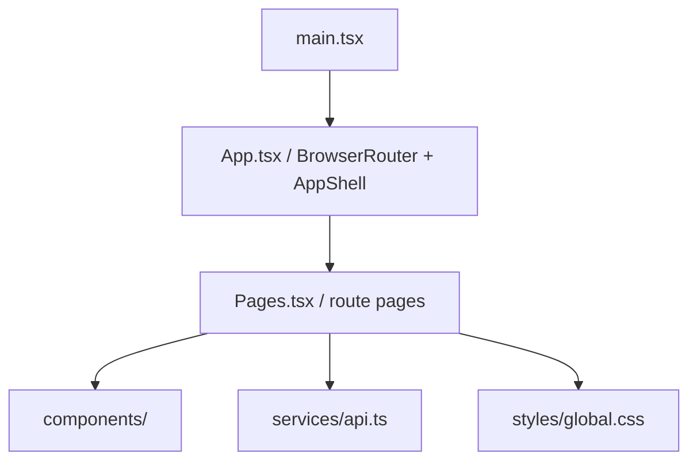

# Frontend Architecture

This guide documents the current frontend implementation in Atenex Nova.

## Scope

The frontend is a Vite + React + TypeScript app that focuses on operational workspace views: collections, query, observability, evaluation, and jobs.

The visual language should follow [design-system/atenex-nova/MASTER.md](../design-system/atenex-nova/MASTER.md) and any page-specific override under [design-system/atenex-nova/pages](../design-system/atenex-nova/pages).

## Entry Points

- App bootstrap: [frontend/src/main.tsx](../frontend/src/main.tsx)
- Router shell: [frontend/src/App.tsx](../frontend/src/App.tsx)
- Shared API client: [frontend/src/services/api.ts](../frontend/src/services/api.ts)
- Main page composition: [frontend/src/pages/Pages.tsx](../frontend/src/pages/Pages.tsx)

## High-Level Structure

## Routing

`App.tsx` defines the route set and wraps them in a shell with sidebar and top bar.

Current routes:

- `/` -> Dashboard
- `/collections` -> Collections
- `/query` -> Query workspace
- `/observability` -> Observability
- `/evaluation` -> Evaluation
- `/jobs` -> Jobs

The app shell supports a collapsed sidebar on desktop and a separate mobile navigation state.

## Page Responsibilities

### Dashboard

The dashboard is a landing surface for current system status and navigation.

### Collections

The collections page is the operational surface for corpus management:

- create collections
- import local files or folders
- upload documents
- rebuild a collection
- inspect document state

The UI currently expects the backend to support pagination for collection documents, and it uses a full-pagination helper in the API client when it needs the complete inventory.

### Query Workspace

The query page is the most complex workspace in the app. It combines:

- collection selector
- route mode selector
- search vs answer action switch
- query composer
- recent memory rail
- document rail
- conversation stream
- evidence rail with answer, citations, and export actions

The current page implementation is intentionally information-dense and is driven by the query-specific design override in [design-system/atenex-nova/pages/query.md](../design-system/atenex-nova/pages/query.md).

### Observability

The observability page surfaces audit trails and document evidence so ingestion and processing steps can be traced after the fact.

### Evaluation

The evaluation page is for dataset-driven runs and regression inspection.

### Jobs

The jobs page shows the background queue and the lifecycle of pending, running, and terminal jobs.

## Data Access

The frontend uses a thin `fetch` wrapper in [services/api.ts](../frontend/src/services/api.ts) rather than a large client framework. The client exposes:

- health
- collections CRUD
- document upload/import/listing
- job listing
- pipeline audit retrieval
- query search and answer generation
- answer export
- evaluation runs

The client is configured by `VITE_API_URL`, defaulting to `http://localhost:8000`.

## Component Pattern

The frontend codebase favors feature-oriented components over shared generic UI primitives. A few important examples:

- `Sidebar`
- `TopBar`
- `AnswerPanel`
- `CitationSidebar`
- `EvidenceCard`
- `PageViewer`

These components are assembled into page-level workspaces rather than used as isolated marketing-style widgets.

## Styling and Design System

Styling is centralized in [frontend/src/styles/global.css](../frontend/src/styles/global.css) and design tokens. The current query workspace uses a more expressive surface hierarchy with lighter cards, chips, and sticky rails, while still keeping the warm palette defined in the design system master.

Practical rules for frontend work:

- prefer the design system master plus page override files
- keep focus states visible
- preserve responsive behavior at narrow widths
- avoid introducing a second visual language inside the same route

## Current Implementation Notes

- The query page now fetches the full collection document inventory through pagination-aware helpers.
- The collections and query surfaces use richer metadata chips to make document state and answer state visible without opening a modal.
- The frontend does not currently rely on a global state library; most state is local to pages and components.

## Related Docs

- [README.md](../README.md)
- [design-system/atenex-nova/MASTER.md](../design-system/atenex-nova/MASTER.md)
- [design-system/atenex-nova/pages/query.md](../design-system/atenex-nova/pages/query.md)
- [design-system/atenex-nova/pages/collections.md](../design-system/atenex-nova/pages/collections.md)
