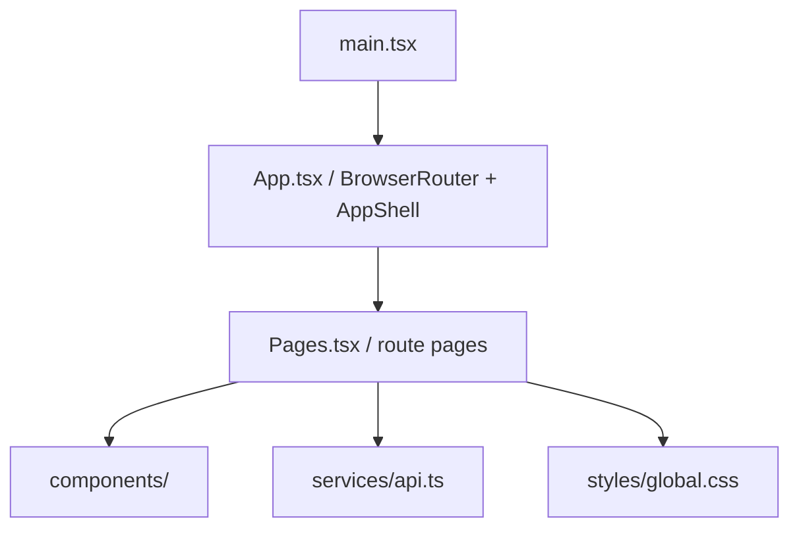

# Frontend Architecture

Estado: **Implemented / Verified** para el contrato de confianza y navegación de
fuentes mediante pruebas y checks focalizados del checkout. La validación contra un
rebuild vivo del corpus permanece **Planned**.

This guide documents the current frontend implementation in Atenex Nova. It belongs
to the document RAG bounded context. Repo Context v1 is CLI/MCP-only and does not add
routes or retrieval behavior to this application.

## Scope

The frontend is a Vite + React + TypeScript app that focuses on operational workspace views: collections, query, observability, evaluation, and jobs.

The visual language should follow [design-system/atenex-nova/MASTER.md](../design-system/atenex-nova/MASTER.md) and any page-specific override under [design-system/atenex-nova/pages](../design-system/atenex-nova/pages).

## Entry Points

- App bootstrap: [frontend/src/main.tsx](../frontend/src/main.tsx)
- Router shell: [frontend/src/App.tsx](../frontend/src/App.tsx)
- Shared API client: [frontend/src/services/api.ts](../frontend/src/services/api.ts)
- Main page composition: [frontend/src/pages/Pages.tsx](../frontend/src/pages/Pages.tsx)

## High-Level Structure

```mermaid
flowchart TB
  main[main.tsx]
  app[App.tsx / BrowserRouter + AppShell]
  pages[Pages.tsx / route pages]
  components[components/]
  services[services/api.ts]
  styles[styles/global.css]

  main --> app
  app --> pages
  pages --> components
  pages --> services
  pages --> styles
```

## Routing

`App.tsx` defines the route set and wraps them in a shell with sidebar and top bar.

Current routes:

- `/` -> Dashboard
- `/collections` -> Collections
- `/query` -> Query workspace
- `/observability` -> Observability
- `/evaluation` -> Evaluation
- `/jobs` -> Jobs

The app shell supports a collapsed sidebar on desktop and a separate mobile navigation state.

## Page Responsibilities

### Dashboard

The dashboard is a landing surface for current system status and navigation.

### Collections

The collections page is the operational surface for corpus management:

- create collections
- import local files or folders
- upload documents
- rebuild a collection
- inspect document state

The UI currently expects the backend to support pagination for collection documents, and it uses a full-pagination helper in the API client when it needs the complete inventory.

### Query Workspace

The query page is the most complex workspace in the app. It combines:

- a compact conversation list
- collection selector
- route mode selector
- search vs answer action switch
- query composer
- recent memory rail
- document rail
- conversation stream
- evidence and technical details revealed on demand

The primary surface stays focused on the conversation. Retrieval controls remain
behind `Ajustes`; citations, evidence, export, and RAG audit stay behind `Ver
fuentes`. The layout is driven by the query-specific design override in
[design-system/atenex-nova/pages/query.md](../design-system/atenex-nova/pages/query.md).

Cada respuesta muestra una presentación localizada del `verdict`, su grounding y
las incidencias de verificación. Los estados `unverified`, `conflicting`,
`partially_verified` o desconocidos producen una alerta visible que no depende del
número de citas. La alerta también cubre respuestas sin citas, grounding bajo y
fallos al hidratar el detalle persistido.

### Observability

The observability page surfaces audit trails and document evidence so ingestion and processing steps can be traced after the fact.

### Evaluation

The evaluation page is for dataset-driven runs and regression inspection.

### Jobs

The jobs page shows the background queue and the lifecycle of pending, running, and terminal jobs.

## Data Access

The frontend uses a thin `fetch` wrapper in [services/api.ts](../frontend/src/services/api.ts) rather than a large client framework. The client exposes:

- health
- collections CRUD
- document upload/import/listing
- job listing
- pipeline audit retrieval
- query search and answer generation
- answer export
- evaluation runs

The client is configured by `VITE_API_URL`, defaulting to `http://localhost:8000`.
Long answer requests keep a provisional turn visible. If the browser loses the
HTTP response while the backend continues, the query page polls the active chat
and hydrates the answer already persisted by the backend.

## Component Pattern

The frontend codebase favors feature-oriented components over shared generic UI primitives. A few important examples:

- `Sidebar`
- `TopBar`
- `AnswerPanel`
- `CitationSidebar`
- `EvidenceCard`
- `PageViewer`

These components are assembled into page-level workspaces rather than used as isolated marketing-style widgets.

## Styling and Design System

Styling is centralized in [frontend/src/styles/global.css](../frontend/src/styles/global.css) and design tokens. The query workspace uses one continuous conversation surface, a restrained conversation list, and on-demand sources/details while retaining the warm palette defined in the design system master.

Practical rules for frontend work:

- prefer the design system master plus page override files
- keep focus states visible
- preserve responsive behavior at narrow widths
- avoid introducing a second visual language inside the same route

## Current Implementation Notes

- The query page now fetches the full collection document inventory through pagination-aware helpers.
- Query metadata is secondary and available on demand so the main conversation is
  not fragmented into nested cards and chips.
- The frontend does not currently rely on a global state library; most state is local to pages and components.
- The primary trust warning derives from `verdict` first and remains visible for an
  unverified or conflicting answer even when it has citations or a nonzero grounding
  score. Verification issues are translated into actionable review text.
- The evidence rail shows up to 20 selected items, reports visible/total counts and
  labels relevance separately from verification. Citations prefer document title,
  section, page and character span; both citations and evidence navigate to the
  document inspector.
- The HTTP contract no longer requires full source transcripts inside evidence
  metadata. The UI renders compact snippets and identifiers and remains compatible
  with the persisted answer hydration flow.
- The hidden 50-document discovery limit was removed in the backend. Corpus-wide
  quality is nevertheless **Planned** until a clean rebuild and the Jesús G benchmark
  verify index completeness.
- Structured claim→span display, explicit/derived claim labels and live capability
  health for reranker/global/visual remain **Planned**.

## Related Docs

- [README.md](../README.md)
- [design-system/atenex-nova/MASTER.md](../design-system/atenex-nova/MASTER.md)
- [design-system/atenex-nova/pages/query.md](../design-system/atenex-nova/pages/query.md)
- [design-system/atenex-nova/pages/collections.md](../design-system/atenex-nova/pages/collections.md)
- [docs/auditoria-rag-respuestas-sota-2026-08-02.md](auditoria-rag-respuestas-sota-2026-08-02.md)
- [docs/plan-rag-sintesis-corpus.md](plan-rag-sintesis-corpus.md)
