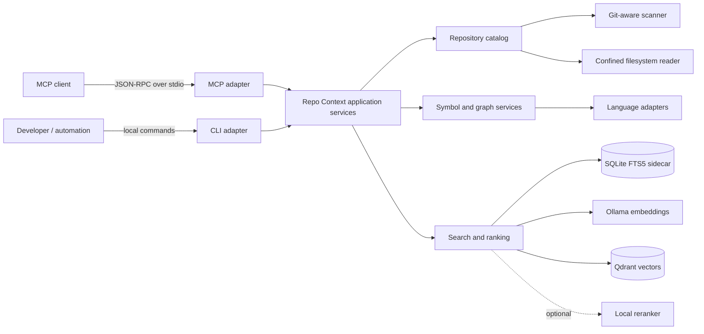

# Repo Context Architecture

> **Runtime status:** **Implemented**  
> **Verification status:** deterministic core, CLI, an official-client MCP
> `stdio` subprocess and two-repository core smoke acceptance are **Verified**.
> Required semantic composition is **Implemented / Verified** con servicios vivos
> sobre Atenex Nova y `client-romero`.

## 1. Purpose

Repo Context is a standalone, local product for giving coding agents and
developers precise, navigable context about a source repository. Atenex Nova is
the first integration repository, but the product must not depend on Atenex
application models, its document-ingestion pipeline, Qdrant, Ollama, or its
frontend.

Version 1 exposes the same read-only application services through:

- an MCP server over `stdio`;
- a local CLI for indexing, inspection, diagnostics, and the same context
  queries.

SQLite indexing remains local and authoritative, while the published MCP runtime
requires local Ollama embeddings, Qdrant and reciprocal-rank fusion (RRF). A missing
or incompatible semantic projection prevents serving tools instead of silently
changing retrieval quality.

## 2. State Boundary

| Capability | State |
|---|---|
| Target architecture and implementation plan | **Implemented** |
| Git-aware repository scan | **Implemented / Verified** |
| SQLite FTS5 lexical index | **Implemented / Verified** |
| AST extraction, symbol graph, and RepoMap | **Implemented / Verified** |
| Read-only MCP `stdio` server | **Implemented / Verified** with an official-client subprocess |
| Local CLI | **Implemented / Verified** |
| Required Ollama/Qdrant semantic tier | **Implemented / Verified** with fake contracts and live two-repository MCP checks |
| Atenex Nova acceptance | **Verified** by the smoke manifest |
| Independent repository acceptance | **Verified** by the same smoke runner and release code |

The existing Atenex RAG implementation remains **Implemented** independently of
this product. Repo Context does not reuse its document memory as an implicit
shortcut.

## 3. Goals and Non-goals

### Goals

- Resolve repository structure, source ownership, symbols, references, tests,
  and likely change impact with file-and-line provenance.
- Remain useful in a dirty worktree and distinguish committed, staged,
  modified, deleted, and untracked content.
- Produce deterministic results for a stable repository snapshot.
- Support Python, TypeScript, TSX, JavaScript, SQL, and Java through AST-aware
  adapters.
- Support Markdown, configuration files, and shell scripts through
  structural/lexical adapters.
- Keep all generated state disposable, repository-local, and outside the
  application databases.
- Serve more than one repository without embedding Atenex-specific rules in the
  core.

### Non-goals for version 1

- A new web UI.
- A writable agent memory, note store, or code-editing tool.
- Source modification, command execution, Git mutation, or test execution
  through MCP.
- Cloud-hosted indexing or a remote network transport.
- A mandatory concrete reranker; the port remains available but unconfigured.
- Whole-program semantic guarantees. Cross-language reference edges remain
  evidence with confidence and provenance, not compiler proofs.
- Indexing binary assets, dependency caches, generated build trees, virtual
  environments, or repository-external paths.

## 4. Architectural Principles

1. **Local and general.** Repository interpretation stays on the host. No core
   contract may assume Atenex entities or services.
2. **Read-only source boundary.** MCP and query commands never edit source,
   Git metadata, application storage, or user documents. The only allowed
   mutation is generated sidecar state under `.atenex/context/`.
3. **Deterministic core first.** Git discovery, FTS5, AST symbols, reference
   edges, and RepoMap are the minimum product, not a fallback demo.
4. **Semantic projection is required.** The MCP server starts only when the active
   SQLite generation has a compatible completed projection in Qdrant.
5. **Snapshot consistency.** Every result identifies the active index
   generation and worktree fingerprint from which it was produced.
6. **Atomic visibility.** Partially built generations are never served.
7. **Provenance over prose.** Results contain repository-relative paths, line
   spans, match reasons, and confidence where inference is involved.
8. **Bounded output.** All list/search/trace responses have limits,
   deterministic ordering, truncation state and omitted counts where
   applicable. Cursor pagination is not part of v1.
9. **Fail closed on paths.** Canonicalized reads must remain inside the
   configured repository root.

## 5. System Context



The MCP and CLI adapters are thin. They validate input, call application
services, and serialize typed results. Repository discovery, ranking, symbol
resolution, and policy enforcement do not live in transport handlers.

## 6. Implemented Module Boundaries

The implementation is a separate bounded context inside the existing backend
distribution:

```text
backend/
├── pyproject.toml
├── atenex_nova/repo_context/
│   ├── domain/
│   │   ├── models.py
│   │   ├── ports.py
│   │   └── policies.py
│   ├── application/
│   │   ├── indexing.py
│   │   ├── overview.py
│   │   ├── search.py
│   │   ├── symbols.py
│   │   └── impact.py
│   ├── infrastructure/
│   │   ├── filesystem.py
│   │   ├── git.py
│   │   ├── sqlite_index.py
│   │   ├── parsers/
│   │   └── semantic/
│   ├── presentation/
│   │   ├── cli.py
│   │   └── mcp_stdio.py
│   └── composition.py
└── tests/repo_context/
```

Names are part of the implemented contract and may move only if the same
boundaries and dependency direction are preserved:

```text
presentation -> application -> domain <- infrastructure
```

The bounded context may use absolute imports from
`atenex_nova.repo_context.*`, but it must not import document-RAG domain or
application models. Semantic integrations implement ports owned by Repo Context.

## 7. Repository Identity and Snapshot Model

### Repository identity

The server receives one repository root at process startup. The root is
canonicalized once, assigned a stable repository identifier derived from the
canonical path, and never replaced by a
tool-call parameter.

### File discovery

For Git repositories, the scanner uses Git-aware enumeration equivalent to:

```text
tracked files + safe untracked files - ignored files
```

It records Git status for eligible files without invoking hooks or changing the
index. Deleted tracked files are absent from the new generation.
A non-Git repository may use a confined filesystem walk and reports that Git
metadata is unavailable.

Default exclusions include:

- `.git/` and `.atenex/context/`;
- virtual environments and dependency caches;
- build, coverage, and generated output directories;
- binary files;
- private-key material and local secret files;
- files above the configured text-size limit.

Exclusions are reported as counts and reasons so an apparently small index is
diagnosable.

### Fingerprint

A worktree fingerprint contains, at minimum:

- repository identity;
- current `HEAD` when Git is available;
- a digest of index/worktree status;
- eligible repository-relative paths, content hashes and file Git status.

Parser and schema versions are stored separately on the generation and
participate in safe extraction reuse.

Indexing captures the fingerprint before and after extraction. A mismatch
prevents activation, so a generation never claims to represent files that
changed during its build.

## 8. Sidecar Storage and Atomic Generations

Generated state lives at:

```text
.atenex/context/index.sqlite3
```

It is disposable and must be ignored by source control. It never stores
application conversations or writable agent memory.

### Logical schema

| Table/index | Purpose |
|---|---|
| `metadata` | Active generation id |
| `generations` | Lifecycle, fingerprint, build diagnostics, parser versions, and activation state |
| `files` | Path, language, Git status, hash, size, and parse state per generation |
| `chunks` | Bounded text units with headings and line spans |
| `search_fts` | SQLite FTS5 searchable files, chunks, symbols and relations |
| `symbols` | Definitions, declarations, signatures, kinds, scopes, and locations |
| `edges` | Imports, references, calls, inheritance, containment, SQL and other typed links |
| `diagnostics` | Skips, parse failures, unresolved links, and degraded adapters |

All indexed records belong to a generation. A build writes a staging
generation while queries continue to use the active one. Activation is a single
SQLite transaction that:

1. verifies the final fingerprint;
2. marks the prior active generation complete and the staging generation active;
3. swaps `metadata.active_generation`;
4. commits.

An interruption leaves the previous generation active. Old and abandoned
generations are garbage-collected only after activation and never as part of a
query.

Incremental indexing reuses unchanged file artifacts by content hash, but the
new generation still owns a complete logical snapshot.

## 9. Language and Extraction Model

| Family | Implemented treatment |
|---|---|
| Python | AST definitions, imports, decorators, signatures, calls, references, and test structure |
| TypeScript / TSX | Tree-sitter definitions/imports/exports/calls when grammar is preloaded; conservative patterns otherwise |
| JavaScript | Tree-sitter module/definition/call structure when grammar is preloaded; conservative patterns otherwise |
| SQL | Tree-sitter statements plus conservative table relations; fallback on syntax/grammar gaps |
| Java | Tree-sitter packages/types/methods/inheritance/calls when grammar is preloaded; conservative patterns otherwise |
| Markdown | Heading hierarchy, links, code fences, anchors, and bounded sections |
| JSON / YAML / TOML and similar config | Key paths, sections, declared scripts/dependencies, and lexical content |
| Shell | Functions, variables, command names, sourced files, and bounded lexical sections |
| Unsupported text | File metadata plus bounded lexical chunks; no fabricated AST claims |

Every adapter emits a common intermediate representation. Parse failure is
file-local: diagnostics are stored and the file falls back to structural or
lexical chunks. One unsupported file cannot invalidate the repository
generation.

## 10. Symbol Graph and RepoMap

The RepoMap is a compact, ranked view of important repository structure. It is
derived from:

- directory and module topology;
- definitions and exports;
- incoming/outgoing symbol edges;
- entry-point and configuration evidence;
- test relationships;
- canonical documentation links;
- Git-aware change status.

When `repo_overview` supplies a focus, the application decomposes recognized
cross-layer intents into a bounded, deterministic query set. It fuses the lexical
rankings by path with RRF and passes shallow-decay path weights into RepoMap. Focused
diversity operates at subsystem level rather than only at top-level application. This
task-local evidence can outweigh unrelated global centrality while entry points and
graph structure continue to act as secondary signals. The exact facets are returned
as `focus_queries` for auditability.

Symbol nodes have stable generation-local identifiers and a qualified name when
the language supplies one. Edges carry:

- edge type;
- source and target location;
- extraction method;
- confidence;
- unresolved target text when exact resolution is impossible.

`trace_symbol` traverses only allowed edge types and depths, prevents cycles,
and returns paths rather than a context-free node dump. Its `both` direction unions
bounded incoming and outgoing evidence for orientation. `analyze_impact` resolves an
exact indexed path through a dedicated path lookup, includes the target file itself,
and remains useful for structural files that expose no AST symbols. It is a
conservative evidence report over reverse edges, module/config relationships, and
related tests. It says “likely affected” instead of claiming compiler-level
completeness.

## 11. Search and Ranking

### Core lexical ranking

SQLite FTS5 plus literal matching is the authoritative service-free search tier.
Query processing first normalizes useful terms, applies bounded deterministic
Spanish/English code synonyms and tries an all-term prefix query. It supplements that
strict pass with an any-term candidate plan for cross-file flows. Ranking combines:

- FTS5 term relevance;
- case-sensitive literal matches in current-generation file text;
- exact symbol and qualified-name matches;
- path and filename matches;
- exact/name/path boosts;
- content, path and symbol term coverage;
- source-role and test-intent weighting;
- file and module diversity;
- optional language, path and symbol-kind filters.

Results are deduplicated into evidence records and ordered deterministically
with repository-relative path and line span as stable tie-breakers.

### Required semantic ranking

For every composed runtime:

1. bounded chunks are embedded through local Ollama;
2. vectors are stored in Qdrant under repository and generation namespaces;
3. lexical and semantic candidate lists are combined with RRF;
4. a local reranker may reorder the fused shortlist.

The active SQLite generation remains the authority. Semantic points from a
different generation are never queried. `search_repo` and focused `repo_overview`
use the fused ranking by default. Missing embeddings, Qdrant, or a compatible
completion sentinel produce `SEMANTIC_UNAVAILABLE`; the server does not publish a
lexical-only MCP under the same contract. Semantic configuration never changes
symbol resolution or path-security rules.

## 12. Public Tool Contract

All MCP tools are implemented, read-only with respect to source, and available
through corresponding CLI queries.

| Tool | Required input | Result |
|---|---|---|
| `repo_overview` | Optional `focus` and token budget | Fingerprint, counts, deterministic focus facets, RRF-focused hits, principal directories, RepoMap and diagnostics |
| `search_repo` | Query; optional path/language/kind/mode filters and limit | Ranked lexical or fused evidence with match reason, excerpt, path, line span, score components, and generation |
| `get_symbol` | Symbol name/qualified name or exact relative path | Candidate definitions or file metadata/top-level symbols, source when requested, and ambiguity diagnostics |
| `trace_symbol` | Resolved symbol plus direction, edge types, and bounded depth | Cycle-safe graph paths with per-edge provenance and confidence |
| `analyze_impact` | One path/symbol plus bounds | Likely affected symbols/files and linked tests, grouped by evidence and confidence |
| `related_tests` | Path or resolved symbol | Ranked tests with explicit import/reference/naming/config evidence and coverage caveats |

Focused overviews use bounded language, directory, landmark and hit lists and omit
duplicate source bodies from focus hits. The nested RepoMap and the common envelope
still expose truncation rather than implying exhaustive coverage.

Common response metadata contains:

- `repo.name` and the fixed public root `"."`;
- `snapshot.generation`, captured `snapshot.head` and
  `snapshot.worktree_fingerprint`;
- `snapshot.stale`;
- truncation and estimated token count;
- diagnostics relevant to the result.

Persistent build/parser diagnostics remain available through `status` and `doctor`;
`repo_overview` exposes only their count in its summary. This prevents a healthy
query from spending its token budget replaying unrelated historical warnings.

`search_repo.data.modes` records effective retrieval modes and each result
contains its score components.

Ambiguous symbols return candidates instead of silently selecting one.
Stale-index, invalid-path, unsupported-mode, limit, and unavailable-semantic-tier
conditions use typed errors.

## 13. CLI and MCP Runtime

The CLI owns lifecycle operations:

```text
atenex-context index
atenex-context status
atenex-context doctor
atenex-context overview
atenex-context search
atenex-context symbol
atenex-context trace
atenex-context impact
atenex-context tests
atenex-context serve --transport stdio
```

The exact flags are implemented, and every query command calls the same
application service used by MCP. `index` builds or refreshes a generation;
`status` reports freshness and diagnostics without presenting stale content as
current.

The MCP transport is `stdio` only in version 1. Protocol output is isolated on
stdout; diagnostics and logs go to stderr. Server startup does not bind a
network port. The local GUI launcher refreshes the sidecar before protocol
startup; no MCP tool refreshes it during a conversation. No MCP tool edits the
worktree or creates writable
memory.

## 14. Security and Trust Boundaries

- Resolve and validate every path after symlink expansion.
- Reject traversal, absolute-path escapes, repository-external symlink targets,
  and requests for Git internals or sidecar internals.
- Do not execute repository commands, package scripts, parsers from the
  repository, Git hooks, or user-provided shell fragments.
- Treat indexed text as untrusted data, not instructions.
- Keep excerpts and response sizes bounded.
- Redact or skip configured secret patterns before persistence.
- Parameterize SQLite queries and validate FTS query syntax.
- Never place secrets, source excerpts, or JSON-RPC payloads in routine logs.
- Keep required semantic services loopback/local by default and expose their
  readiness explicitly.

## 15. Observability and Failure Semantics

Each generation records file counts, reused hashes, parse results, exclusions,
unresolved edges, elapsed build measurements, and semantic health. This is
operational metadata, not user telemetry.

Failures are isolated where safe:

- parse error -> lexical fallback for that file;
- unsupported language -> lexical indexing;
- semantic dependency failure -> `SEMANTIC_UNAVAILABLE` and no MCP publication;
- changed worktree during build -> staging generation rejected;
- corrupt or incompatible sidecar -> explicit rebuild required;
- no valid active generation -> query tools fail with an actionable stale/index
  error, never an empty success.

Index publication is a single-writer operation per sidecar. A process-owned advisory
lock covers both SQLite generation publication and its required semantic projection;
simultaneous client startups wait for the current writer instead of racing schema or
generation writes. The lock file may remain after a crash, but kernel ownership is
released with the process.

## 16. Acceptance Boundary

The deterministic core is **Implemented** and the same release code historically
passed the Atenex Nova and independent-repository smoke manifests without Ollama or
Qdrant. That remains component evidence, not the current MCP serving contract.
The official MCP 2.0 client initialized a real `stdio` subprocess, discovered the
six tools and invoked `repo_overview` successfully with the isolated local runtime.
A broader cross-platform subprocess matrix remains planned for the canonical
Python 3.12 runtime.

The independent acceptance checkout used locally was:

```text
/mnt/ssd/Nyro/panaderia_romero/client-romero
```

That repository is acceptance input, not a source dependency and not a location
for product-specific code. Detailed gates are defined in
[plan-repo-context-mcp.md](plan-repo-context-mcp.md).

## 17. Related Documents

- [Documentation index](README.md)
- [Repo Context implementation plan](plan-repo-context-mcp.md)
- [Atenex product baseline](baseline.md)
- [Atenex canonical technical audit](auditoria-completa.md)
- [Current Atenex backend architecture](architecture-backend.md)
