# Auditoría del plan RAG de Atenex Nova + diagramas corregidos

## Base usada para esta auditoría

Esta auditoría se apoya en cinco fuentes que, juntas, sí fijan el estado técnico útil del sistema:

1. **Plan/base RAG**: plantea que Atenex Nova no debe ser “single prompt over top-k chunks”, sino un sistema de memoria documental multicapa, local-first, con `query routing` antes de generación, memoria por estructura/pasajes/proposiciones/resúmenes/páginas visuales y arquitectura hexagonal por capas. fileciteturn4file0
2. **README**: define el stack operativo declarado, los modos de consulta, el monolito modular con motores locales y la estructura general del proyecto. fileciteturn4file3
3. **AGENTS**: fija la precedencia documental, las reglas de arquitectura, los entry points y dónde viven los componentes críticos del backend y frontend. fileciteturn4file2
4. **Inventario final de brechas**: es la fuente canónica del estado real del backend y del gap frente a `baseline.md`; además afirma explícitamente que el snapshot sí inspeccionó orquestadores, policies, routers, repositorios SQL, workers, tests, frontend y prompts. fileciteturn4file1

5. **Contrato OpenAPI/documentación**: `docs/api-endpoints.md` lista la superficie HTTP pública y un test unitario compara esas rutas contra el OpenAPI generado por FastAPI para detectar drift.

## Hallazgo rector

El diseño conceptual del plan es bueno. El problema no está en la visión, sino en el cierre operativo del backend real. El repositorio ya tiene monolito modular, ingesta estructural, memorias multicapa, routing por modo, evidence packing, verificación en dos pasos, viewer visual y health checks; pero sigue incompleto en cuatro puntos que cambian la arquitectura efectiva del pipeline:

- **sparse retrieval persisted real** todavía no está cerrado en el motor principal,
- **reranking fuerte** sigue siendo heurístico,
- **graph expansion** existe pero está por debajo del baseline para multi-hop complejo,
- **ruta visual strict** no está endurecida como contrato de fallo explícito. fileciteturn4file1

Por eso, los diagramas correctos no deben dibujar un sistema “perfecto”, sino uno **real con brechas visibles**.

---

## 1) Arquitectura real del sistema: vista ejecutiva corregida

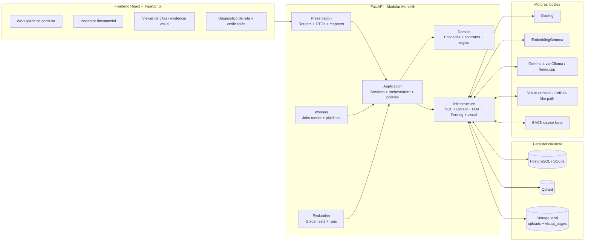

### Lectura correcta

- El repositorio declara y el inventario confirma un **monolito modular hexagonal** con separación `presentation -> application -> domain -> infrastructure`, workers y evaluation. fileciteturn4file2 fileciteturn4file1
- El **Frontend** ya no es decorativo: el inventario dice que workspace, inspector, citas, evidencia visual y diagnóstico existen y son operativos, aunque faltan estados límite y aceptación e2e completa. fileciteturn4file1
- La arquitectura **real** todavía no es perfectamente hexagonal porque persisten algunos acoplamientos puntuales entre routers, servicios y repositorios. fileciteturn4file1

---

## 2) Flujo de ingesta real: cómo debería leerse hoy

El plan exige entender documento antes de vectorizarlo y construir varias memorias, no una sola colección de chunks. fileciteturn4file0 El README también declara cuatro vistas: spans estructurales, chunks de retrieval, proposiciones y resúmenes jerárquicos. fileciteturn4file3 El inventario confirma que eso existe, pero no completamente cerrado en fidelidad estructural ni en política estricta de chunking por tokens. fileciteturn4file1

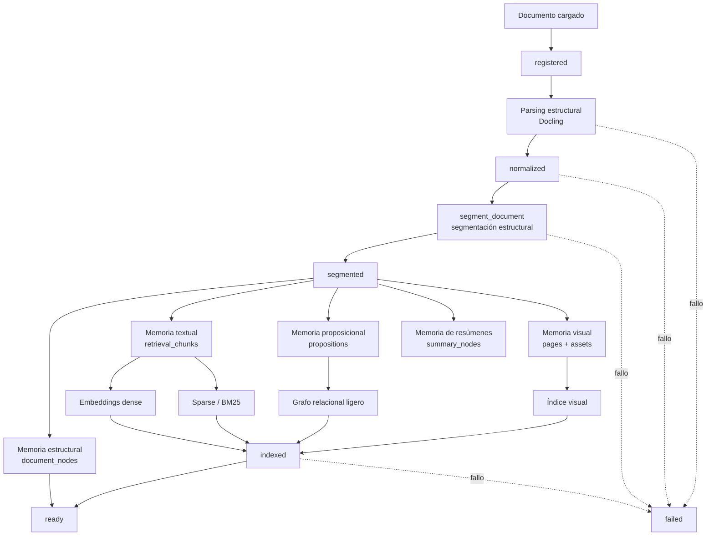

### Lo que está bien

- El inventario confirma el pipeline de estados documentales y la persistencia de nodos, chunks, proposiciones y resúmenes. fileciteturn4file1
- También confirma que existe ruta visual con assets de página y viewer. fileciteturn4file1

### Lo que sigue mal o incompleto

- La **fidelidad al árbol documental** todavía es parcial para layouts complejos, tablas, captions y footnotes. fileciteturn4file1
- La **segmentación** aún no está cerrada como contrato estricto de presupuesto de tokens y trazabilidad nodo→chunk. fileciteturn4file1
- La estabilidad histórica de `segment_document` sigue siendo deuda operativa. fileciteturn4file1

---

## 3) Mapa de memorias: el corazón correcto del sistema

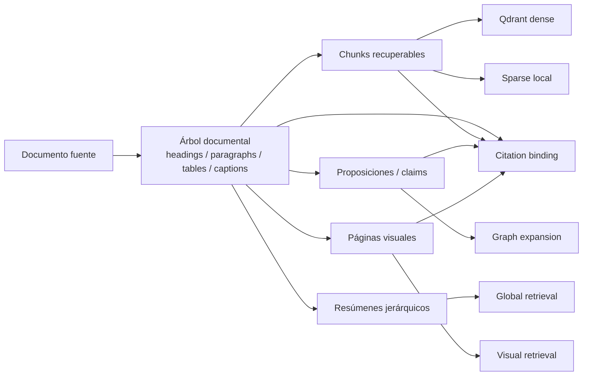

### Interpretación

El plan pide explícitamente memoria por estructura documental, pasajes, proposiciones, resúmenes jerárquicos y páginas visuales. fileciteturn4file0 El inventario confirma que las cinco rutas existen en el backend real, aunque con coberturas distintas. fileciteturn4file1

### Estado real por memoria

- **Estructural**: existe, pero no ha probado todavía cobertura contractual total de layouts complejos. fileciteturn4file1
- **Textual**: existe y se usa en runtime. fileciteturn4file1
- **Proposicional**: existe y se consulta, pero su explotación para multi-hop aún puede fortalecerse. fileciteturn4file1
- **Resúmenes jerárquicos**: existen y participan en retrieval global. fileciteturn4file1
- **Visual**: existe, con assets y viewer, pero strict mode no está cerrado. fileciteturn4file1

---

## 4) Pipeline real de consulta: corregido contra el backend actual

El README dibuja un pipeline simple: `Pregunta -> Preprocesamiento -> Clasificación -> Routing -> Recuperación -> Fusión + Reranking -> Evidence Pack -> Síntesis -> Verificación -> Respuesta`. fileciteturn4file3 Eso es útil, pero incompleto para auditar el backend real.

El pipeline correcto hoy es este:

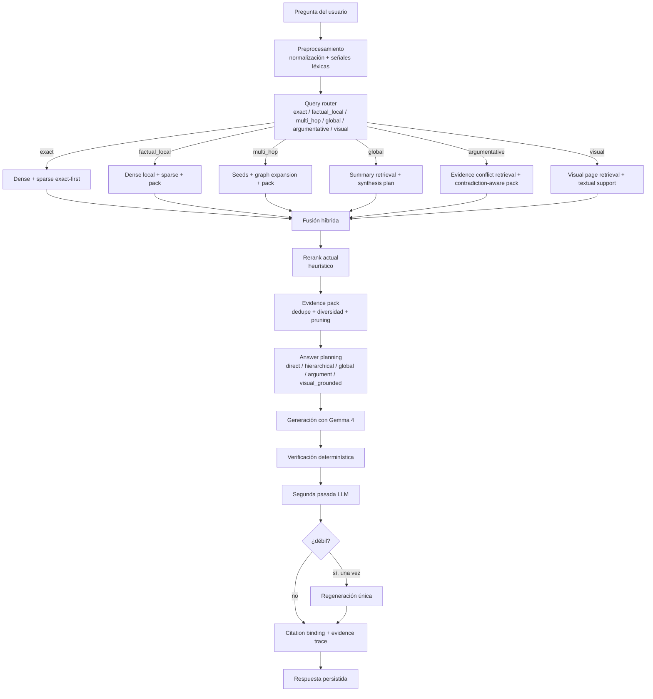

### Qué sí está implementado

- Query routing por modo con `route_reason`. fileciteturn4file1
- Hybrid retrieval por etapas. fileciteturn4file1
- Evidence packing con deduplicación, diversidad y manejo de contradicción. fileciteturn4file1
- Answer planning (`direct`, `hierarchical`, `global`, `argument`, `visual_grounded`). fileciteturn4file1
- Verificación en dos pasos y una sola regeneración. fileciteturn4file1

### Qué obliga a corregir el diagrama ideal

- El **rerank** actual no es fuerte; sigue siendo heurístico. No debe dibujarse como si ya fuera late interaction o cross-encoder real. fileciteturn4file1
- El **sparse** aún no está cerrado como índice primario persisted alineado al baseline. fileciteturn4file1
- El **multi-hop** ya usa expansión, pero con menos tipado y menos robustez de la que el baseline espera. fileciteturn4file1

---

## 5) Tabla de modos y motores de acceso

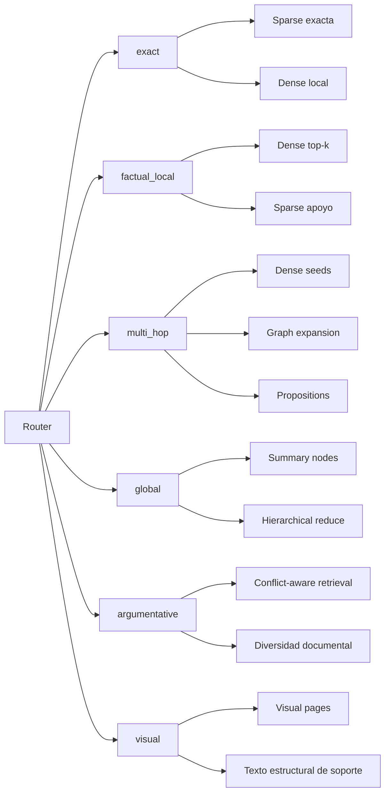

### Comentario arquitectónico

Los seis modos del README son válidos como contrato de producto. fileciteturn4file3 El inventario confirma que están implementados en existencia, pero todavía no aprobados de forma reproducible por evaluación formal, porque faltan goldens y runs completos por modo. fileciteturn4file1

---

## 6) Dónde está hoy el cuello del retrieval

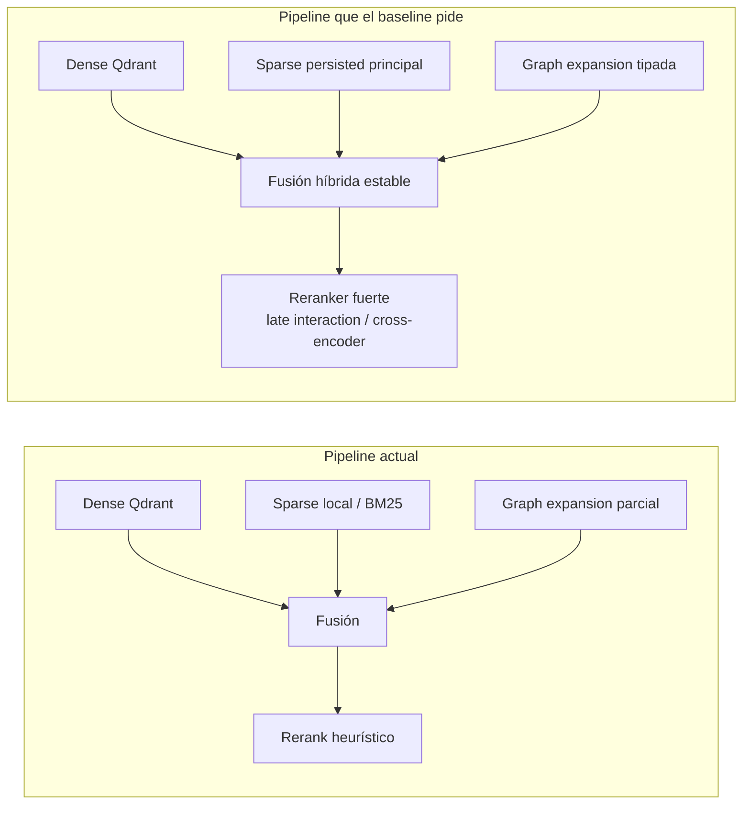

### Conclusión precisa

La gran diferencia entre el plan y el backend real no está en “falta de componentes”, sino en **nivel de cierre de los componentes de retrieval**. El inventario lo deja explícito: Qdrant ya es la fuente principal dense, pero faltan sparse persisted, reranking fuerte y graph expansion más rico. fileciteturn4file1

---

## 7) Flujo de citas y grounding: componente que no debe simplificarse

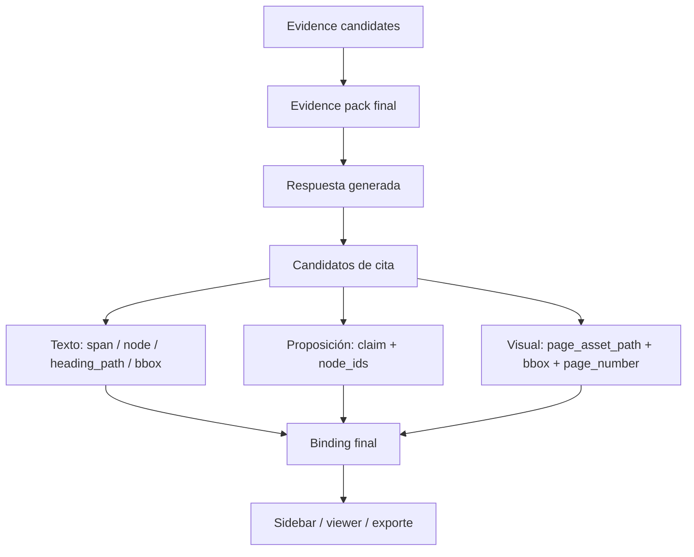

### Qué dice el estado real

- Ya existe metadata enriquecida de grounding, incluyendo `bbox`, `heading_path` y `page_asset_path`. fileciteturn4file1
- Pero el inventario no da por cerrado el **binding estricto a spans reales** en todas las clases de evidencia. fileciteturn4file1

### Riesgo si no se corrige

Si esta parte se dibuja como “resuelta”, el sistema parece más sólido de lo que realmente es. En Atenex Nova, la credibilidad del producto depende de que cada cita sea navegable hasta evidencia real, no aproximada. El propio inventario lo trata como brecha alta. fileciteturn4file1

---

## 8) Ruta visual real: cómo debe diagramarse hoy

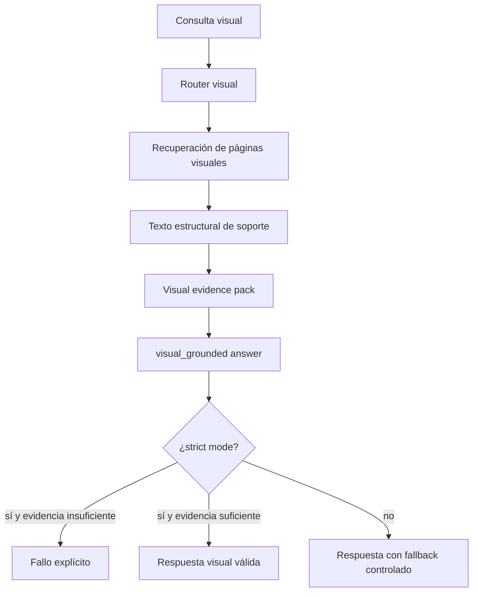

### Estado real

La ruta visual existe con indexación, assets y viewer, pero **strict mode** todavía no está cerrado como regla dura; además no hay evidencia de cobertura total de render real por formato. fileciteturn4file1

### Implicación

No conviene seguir mostrando la ruta visual como una simple rama equivalente a las otras. Arquitectónicamente es una ruta con política de fallo propia.

---

## 9) Jobs y workers: lectura correcta del backend

AGENTS identifica `backend/atenex_nova/workers/main.py` y `workers/runner.py` como piezas que deben revisarse juntas. fileciteturn4file2 El inventario además confirma runner operativo y recuperación de jobs huérfanos. fileciteturn4file1

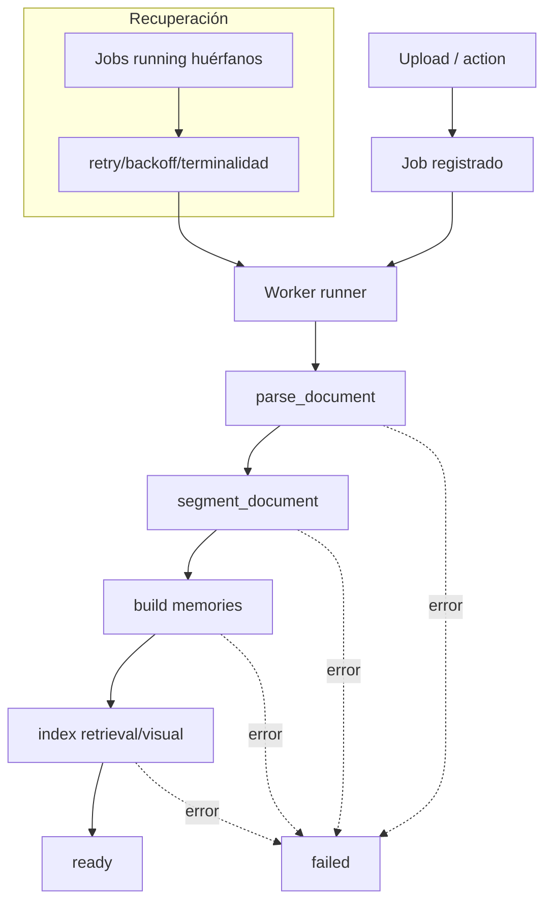

### Nota de auditoría

Aquí el problema principal ya no es inexistencia del worker model, sino cierre fino de invariantes de estado y de rebuild idempotente del documento. fileciteturn4file1

---

## 10) La arquitectura documental correcta del backend

El README contiene una vista útil, pero demasiado general. fileciteturn4file3 Para evitar errores de diseño, el backend debería leerse así:

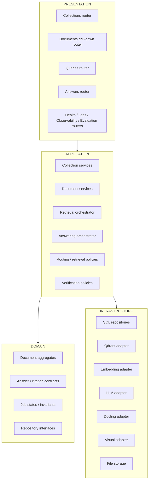

### Corrección clave

El inventario marca como brecha alta que **ningún router debería acceder a infraestructura directamente** y que aún quedan acoplamientos puntuales. fileciteturn4file1 Ese detalle debe aparecer en el diagrama, porque altera el criterio de cierre del backend.

---

### Superficie HTTP verificada

La superficie pública actual no se debe reconstruir desde memoria ni desde el roadmap: queda anclada a `docs/api-endpoints.md` y al OpenAPI generado por `atenex_nova.main:create_app`. El contrato ligero cubre los grupos `health`, `collections`, `documents`, `queries`, `answers`, `jobs`, `observability` y `evaluation`, incluyendo `/health/dependencies` y el drill-down documental `/documents/{document_id}/nodes`, `/structure`, `/chunks`, `/propositions` y `/pages/{page_number}`. Este contrato pasa en aislamiento, aunque los gates globales de unit tests, frontend build/lint, `ruff` y `mypy` siguen abiertos en el checkout actual.

---

## 11) Gap real resumido en una sola lámina

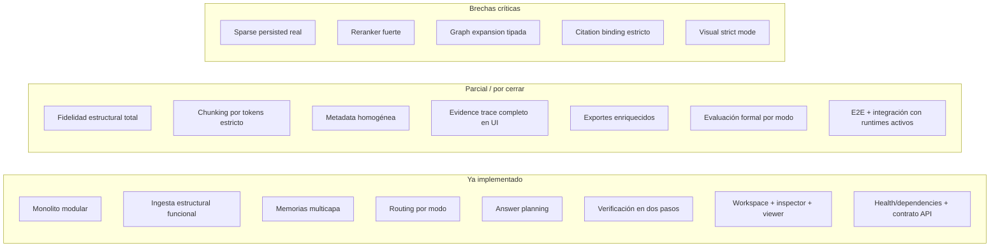

Todo lo de la columna crítica sale textual del inventario como bloqueante o de prioridad alta para alcanzar el baseline. fileciteturn4file1

---

## 12) Arquitectura objetivo corregida: la que sí conviene implementar

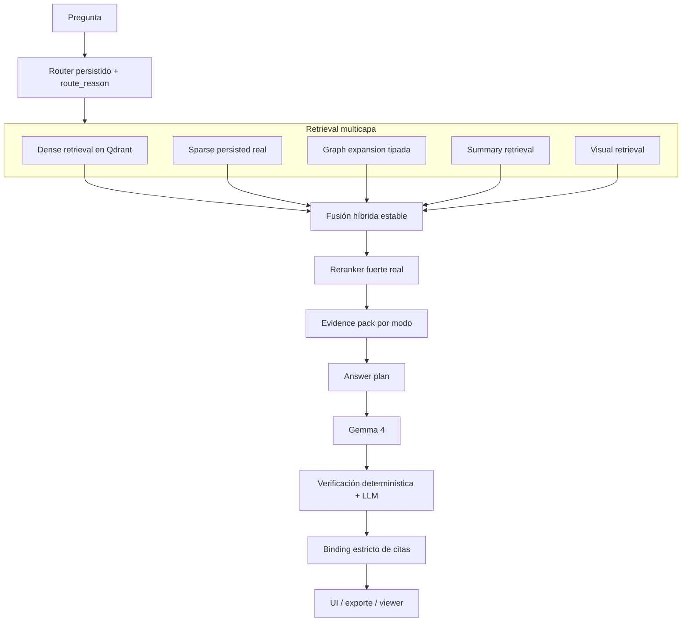

### Por qué este es el diagrama correcto

Porque respeta el plan original de memoria multicapa, query routing y generador como sintetizador, pero además incorpora las correcciones que el estado real del backend exige: sparse persisted, reranker fuerte, graph expansion tipada y binding/citas estrictas. fileciteturn4file0 fileciteturn4file1

---

## Conclusiones de auditoría

### 1. El plan conceptual está bien enfocado

Atenex Nova sí está bien concebido como plataforma local de memoria documental y no como chatbot vectorial. La apuesta por parseo estructural, varias memorias, routing por modo y síntesis sobre evidencia es coherente. fileciteturn4file0

### 2. El README simplifica demasiado el pipeline real

Sirve como onboarding, pero no sirve por sí solo para auditar el backend. Le faltan dos cosas esenciales: mostrar que el rerank actual sigue siendo heurístico y mostrar que la ruta visual tiene política de strict failure separada. fileciteturn4file3 fileciteturn4file1

### 3. La fuente correcta para “estado del backend” es el inventario final

AGENTS lo trata como inventario canónico del gap y el propio documento dice que revisó routers, orquestadores, repositorios, workers, frontend y tests. Por tanto, para no introducir errores, la arquitectura debe dibujarse contra ese snapshot. fileciteturn4file2 fileciteturn4file1

### 4. El backend ya tiene el 80% de la topología, pero no el 100% del cierre del retrieval

Lo crítico pendiente no es agregar muchas cajas nuevas, sino endurecer el retrieval core y el grounding: sparse persisted, reranking fuerte, expansión de grafo tipada, citation binding estricto y visual strict mode. fileciteturn4file1

### 5. Si quieres evitar errores de implementación, el orden correcto de trabajo es este

1. cerrar sparse persisted,
2. cerrar reranker fuerte,
3. tipar graph expansion,
4. endurecer citation binding,
5. cerrar visual strict mode,
6. recién después declarar el pipeline RAG “completo”.

Ese orden sale directamente del peso arquitectónico de las brechas altas del inventario. fileciteturn4file1
