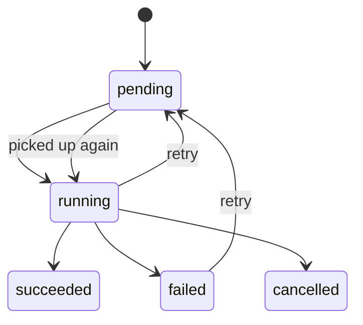

# Jobs and Workers

This document describes the current background job system used by Atenex Nova.

## Core Model

Jobs are domain entities with these key fields:

- `id`
- `job_type`
- `target_id`
- `status`
- `payload`
- `result`
- `error`
- `retries`
- `max_retries`
- timestamps for create, start, and completion

See [backend/atenex_nova/domain/entities/job.py](../backend/atenex_nova/domain/entities/job.py).

## Job Status Flow

Current statuses are:

- `pending`
- `running`
- `succeeded`
- `failed`
- `cancelled`

## Worker Process

The worker entry point is [backend/atenex_nova/workers/main.py](../backend/atenex_nova/workers/main.py). It:

1. loads settings and logging
2. creates a shared async session factory
3. constructs a `JobRunner`
4. registers a handler per job type
5. loops until stopped

The dispatcher itself is implemented in [backend/atenex_nova/workers/runner.py](../backend/atenex_nova/workers/runner.py).

## Registered Handlers

The current worker registers handlers for:

- `parse_document`
- `normalize_document`
- `segment_document`
- `embed_document`
- `embed_chunks`
- `rebuild_collection`
- `extract_propositions`
- `generate_summaries`
- `embed_propositions`
- `embed_summaries`
- `build_graph`
- `index_visual_pages`

## Ingestion Pipeline

The ingestion flow is chained through jobs.

### 1. Parse

Handler: `ParseDocumentJobHandler`

- resolves the source path against current and legacy layouts
- parses the document with the Docling adapter
- persists structural nodes
- marks the document parsed
- enqueues `NORMALIZE_DOCUMENT`

### 2. Normalize

Handler: `NormalizeDocumentJobHandler`

- trims whitespace on structural nodes
- updates normalized text in storage
- marks the document normalized
- enqueues `SEGMENT_DOCUMENT`

### 3. Segment and Embed

Handler: `SegmentDocumentJobHandler`

- groups normalized nodes into chunks of about 1000 characters
- persists chunks
- marks the document segmented
- enqueues `EMBED_DOCUMENT`

Handler: `EmbedDocumentJobHandler`

- embeds chunks with EmbeddingGemma using configured profile dimensions
- initializes the Qdrant collection for the current corpus
- stores vector payloads
- marks the document embedded and indexed
- marks the document ready immediately only when strict mode is disabled
- enqueues `EXTRACT_PROPOSITIONS`

## Memory Enrichment Pipeline

### Propositions

Handler: `ExtractPropositionsJobHandler`

- splits chunk text into sentences
- classifies each proposition as fact, definition, procedure, rule, causal, or comparison
- persists propositions
- enqueues embedding, summary, and graph jobs

### Proposition Embedding

Handler: `EmbedPropositionsJobHandler`

- embeds proposition text with EmbeddingGemma
- writes vectors to Qdrant
- in strict mode, Qdrant/embedding failures propagate as explicit job failures

### Summaries

Handler: `GenerateSummariesJobHandler`

- builds section summaries from chunks
- builds a document summary
- builds a collection summary
- persists all summaries
- enqueues summary embedding

### Summary Embedding

Handler: `EmbedSummariesJobHandler`

- embeds section, document, and collection summaries
- writes them to the collection summaries index
- in strict mode, Qdrant/embedding failures propagate as explicit job failures

### Graph Building

Handler: `BuildGraphJobHandler`

- creates proposition-to-document edges
- creates proposition-to-proposition edges using simple heuristic relations
- persists relation edges through the graph store

## Visual Indexing

Handler: `IndexVisualPagesJobHandler`

- groups structural nodes by page
- flags complex pages based on node types, text length, and node count
- prepares page payloads for the ColPali adapter
- upserts page representations for later visual retrieval
- transitions the document to `ready` at the end of the enrichment chain

## Rebuild Flow

Handler: `RebuildCollectionJobHandler`

- removes pending jobs for the collection and its documents
- resets each document to `registered`
- deletes chunks, propositions, summaries, relations, and nodes
- clears the visual page cache
- enqueues new `PARSE_DOCUMENT` jobs

## Runner Behavior

The runner polls the database every few seconds. For each pending job it:

1. marks the job running
2. dispatches the correct handler
3. stores success or failure state
4. increments retries on failure

If a handler is missing, the job is failed immediately with a descriptive error.

## Operational Notes

- The worker currently relies on database polling rather than an external queue.
- Audit events are written during most stages so the pipeline can be inspected later.
- The graph path is intentionally lightweight today; it is good enough for current routing but does not yet implement a full semantic graph engine.

## Related Docs

- [docs/architecture-backend.md](architecture-backend.md)
- [docs/api-endpoints.md](api-endpoints.md)
