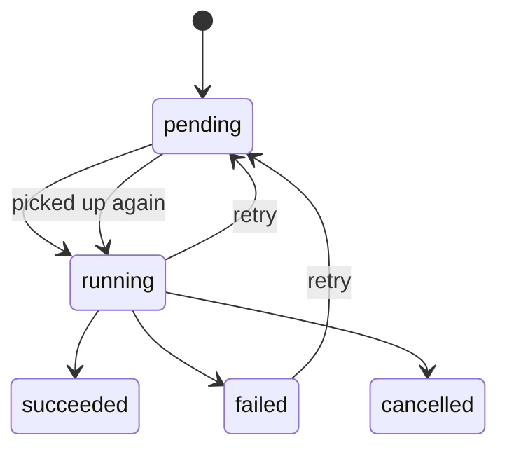

# Jobs and Workers

Estado: **Implemented / Verified** en pruebas focalizadas. El rebuild limpio con
servicios vivos y activación atómica entre todos los stores sigue **Planned**.

This document describes the current background job system used by the document RAG
bounded context. Repo Context indexing is not another document-ingestion job chain:
v1 runs only from the explicit `atenex-context index` command. MCP startup validates
the active generation but never indexes as a side effect. It uses a SQLite
transaction and atomic generation activation; see
[indexing-and-storage.md](indexing-and-storage.md).

## Core Model

Jobs are domain entities with these key fields:

- `id`
- `job_type`
- `target_id`
- `status`
- `payload`
- `result`
- `error`
- `retries`
- `max_retries`
- timestamps for create, start, and completion

See [backend/atenex_nova/domain/entities/job.py](../backend/atenex_nova/domain/entities/job.py).

## Job Status Flow

```mermaid
stateDiagram-v2
  [*] --> pending
  pending --> running
  running --> succeeded
  running --> failed
  running --> pending: retry
  running --> cancelled
  failed --> pending: retry
  pending --> running: picked up again
```

Current statuses are:

- `pending`
- `running`
- `succeeded`
- `failed`
- `cancelled`

## Worker Process

The worker entry point is [backend/atenex_nova/workers/main.py](../backend/atenex_nova/workers/main.py). It:

1. loads settings and logging
2. acquires a process-owned advisory lock when the backend is SQLite
3. creates a shared async session factory
4. constructs a `JobRunner`
5. registers a handler per job type
6. loops until stopped and releases the advisory lock in `finally`

The dispatcher itself is implemented in [backend/atenex_nova/workers/runner.py](../backend/atenex_nova/workers/runner.py).

## Registered Handlers

The current worker registers handlers for:

- `parse_document`
- `normalize_document`
- `segment_document`
- `embed_document`
- `embed_chunks`
- `rebuild_collection`
- `extract_propositions`
- `generate_summaries`
- `embed_propositions`
- `embed_summaries`
- `build_graph`
- `index_visual_pages`
- `check_document_readiness`
- `build_collection_memory`
- `embed_collection_memory`

## Ingestion Pipeline

The ingestion flow is chained through jobs.

### 1. Parse

Handler: `ParseDocumentJobHandler`

- resolves the source path against current and legacy layouts
- parses the document with the Docling adapter
- recognizes transcript envelopes, caption timestamps and temporal blocks
- preserves original/normalized offsets and structural metadata separately from text
- persists structural nodes
- marks the document parsed
- enqueues `NORMALIZE_DOCUMENT`

### 2. Normalize

Handler: `NormalizeDocumentJobHandler`

- trims whitespace on structural nodes
- updates normalized text in storage
- marks the document normalized
- enqueues `SEGMENT_DOCUMENT`

### 3. Segment and Embed

Handler: `SegmentDocumentJobHandler`

- groups complete normalized nodes when they fit and subdivides every oversized node
  at semantic boundaries
- enforces a hard cap of 800 estimated tokens with 80 tokens of overlap
- persists node IDs, source offsets/spans, headings, page and transcript timestamps
- persists chunks
- marks the document segmented
- enqueues `EMBED_DOCUMENT`

Handler: `EmbedDocumentJobHandler` (handles both `EMBED_DOCUMENT` and `EMBED_CHUNKS` job types)

- embeds chunks with EmbeddingGemma using the document prefix and configured profile
  dimensions; query embeddings use a distinct query prefix
- sends Ollama inputs in ordered, cardinality-checked batches; the measured local
  default is 256 inputs for the RTX 4060
- binds stored vectors to the `emb-v2` contract fingerprint
- normalizes and quantizes chunk vectors via `IngestionOrchestrator` for a bounded
  fallback path while storing dense vectors primarily in Qdrant
- initializes the Qdrant collection for the current corpus
- stores vector payloads in Qdrant in ordered batches of 256 with `wait=true`; a
  partial remote write raises so the idempotent job is retried instead of published
  as complete
- marks the document embedded and indexed
- enqueues `EXTRACT_PROPOSITIONS`

## Memory Enrichment Pipeline

### Propositions

Handler: `ExtractPropositionsJobHandler`

- splits chunk text into sentences
- classifies each proposition as fact, definition, procedure, rule, causal, or comparison
- persists propositions
- enqueues embedding, summary, and graph jobs

### Proposition Embedding

Handler: `EmbedPropositionsJobHandler`

- embeds proposition text with EmbeddingGemma
- writes vectors to Qdrant through the same bounded Ollama/Qdrant batch contracts
- in strict mode, Qdrant/embedding failures propagate as explicit job failures

### Summaries

Handler: `GenerateSummariesJobHandler`

- builds exactly one extractive section summary per chunk and one document summary
- stores child IDs, source spans and algorithm/version details in provenance
- upserts each scope idempotently and removes obsolete duplicates
- never creates a collection summary as a side effect of one document
- enqueues summary embedding

### Summary Embedding

Handler: `EmbedSummariesJobHandler`

- embeds section and document summaries with document-mode inputs
- writes them to the collection summaries index through bounded batches
- in strict mode, Qdrant/embedding failures propagate as explicit job failures

### Collection memory

Handler: `BuildCollectionMemoryJobHandler`

- is started explicitly for one collection after document readiness
- pages through all ready document summaries in bounded batches
- performs an ordered hierarchical extractive reduction
- upserts exactly one collection summary with source counts, selected child IDs,
  digest, levels and method in provenance
- enqueues replacement of its vector and cleanup of obsolete collection summaries

Handler: `EmbedCollectionMemoryJobHandler`

- removes obsolete SQL/candidate/Qdrant representations for that scope
- embeds the single current collection summary
- indexes its dense and sparse representations using the same embedding contract

### Graph Building

Handler: `BuildGraphJobHandler`

- creates proposition-to-document edges
- creates proposition-to-proposition edges using adjacency and keyword heuristics
  inside the current document; it does not link concepts across the collection
- persists relation edges through the graph store

### Readiness barrier

Handler: `CheckDocumentReadinessJobHandler`

- requires an indexed document, chunks and chunk embeddings, propositions and their
  embeddings, exactly one section summary per chunk, exactly one document summary,
  summary embeddings, a successful graph job and visual indexing when applicable
- marks `indexed -> ready` only when that report is complete
- demotes a stale `ready` document and enqueues the minimal missing repair path during
  resume/recovery

This barrier is **Implemented / Verified** as a temporal check over current artifacts
and successful jobs. A shared `generation_id` and atomic activation across SQL,
Qdrant, candidate indexes, summaries and graph remain **Planned**.

## Visual Indexing

Handler: `IndexVisualPagesJobHandler`

- groups structural nodes by page
- flags complex pages based on node types, text length, and node count
- prepares text page payloads for the adapter currently named ColPali; the live
  implementation does not encode page pixels with a vision model
- upserts page representations for later visual retrieval (and normalizes, quantizes, and indexes the visual page vectors via `IngestionOrchestrator`)
- enqueues `CHECK_DOCUMENT_READINESS`; visual completion never publishes `ready` by
  itself

## Rebuild Flow

Handler: `RebuildCollectionJobHandler`

- refuses to start while any target job is `running`
- pages the full document inventory and captures chunk, proposition, summary and
  visual IDs before deleting relational rows
- removes collection namespaces for chunks, propositions and summaries plus visual
  points; also removes candidate/quantized vectors, incoming and outgoing graph
  edges, cached page payloads and guarded visual assets
- deletes pending work, resets each document to `registered` and enqueues exactly one
  new `PARSE_DOCUMENT` job per document
- is idempotent and reports whether optional Qdrant cleanup completed; a required
  Qdrant failure aborts instead of claiming success

The cleanup covers all current namespaces but does not provide definitive staged
generation activation or prove cross-store cardinality after a live rebuild. A
rebuild must not be treated as coherent until the remaining generation work in
[plan-rag-sintesis-corpus.md](plan-rag-sintesis-corpus.md) is implemented.

## Runner Behavior

The runner polls the database every few seconds. For each pending job it:

1. marks the job running
2. dispatches the correct handler
3. stores success or failure state
4. increments retries on failure

If a handler is missing, the job is failed immediately with a descriptive error.

## Operational Notes

- The worker currently relies on database polling rather than an external queue.
- SQLite permits exactly one worker. `storage/worker.lock` may remain after a crash;
  ownership is the kernel advisory lock, so a stale file no longer blocks restart.
- `ATENEX_DEBUG=false` avoids SQL echo overhead during bulk ingestion. Production
  rebuilds should set `ATENEX_REQUIRE_EMBEDDINGS=true` and
  `ATENEX_REQUIRE_QDRANT=true` so no fallback or partial remote index is accepted.
- Audit events are written during most stages so the pipeline can be inspected later.
- The graph path is intentionally lightweight and has not been shown to improve the
  Jesús G benchmark; it is not a semantic corpus graph.
- The 2026-08-02 audit snapshot had 1,754 `ready` documents with at least one pending
  or active job each. That observation is **Historical** relative to the new readiness
  code; no clean live rebuild has revalidated the collection.
- Source and runtime evidence are recorded in
  [auditoria-rag-respuestas-sota-2026-08-02.md](auditoria-rag-respuestas-sota-2026-08-02.md).

## Related Docs

- [docs/architecture-backend.md](architecture-backend.md)
- [docs/turboquant-integration.md](turboquant-integration.md)
- [docs/api-endpoints.md](api-endpoints.md)
- [docs/auditoria-rag-respuestas-sota-2026-08-02.md](auditoria-rag-respuestas-sota-2026-08-02.md)
