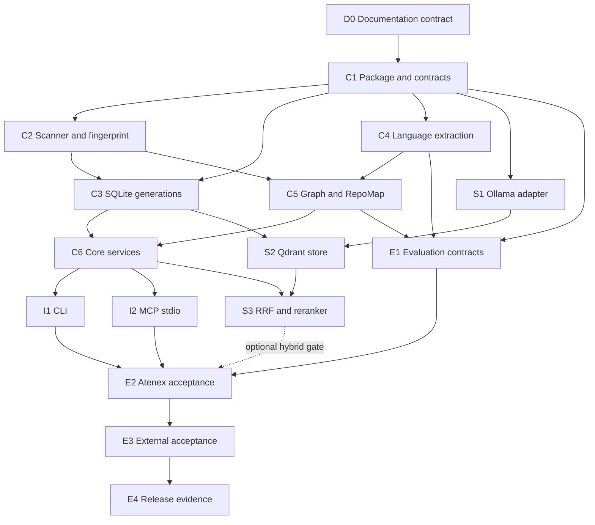

# Repo Context MCP — Implementation Plan

> **Delivery status:** deterministic core **Implemented / Verified** by smoke
> acceptance.  
> **Remaining release status:** concrete reranking and the extended
> held-out/performance matrix are **Planned**; required live semantic providers are
> **Verified** on both acceptance repositories.
> **Architecture contract:** [architecture-repo-context.md](architecture-repo-context.md)
> **Contract update (2026-08-03):** ADR-0007 makes the semantic projection required
> for MCP. Earlier gates below that exercise “semantic disabled” are **Historical**
> evidence for the SQLite core, not the current serving contract.

## 1. Outcome

Deliver a local, repository-agnostic Repo Context product that indexes a source
tree, builds a lexical and symbol-aware RepoMap, and exposes precise read-only
context through a CLI and MCP `stdio` server.

The service-free core must work with:

- a Git-aware scanner;
- SQLite FTS5;
- AST/structural extraction;
- a symbol/reference graph;
- RepoMap ranking.

Local Ollama embeddings, Qdrant, and RRF are runtime prerequisites; the concrete
reranker remains **Planned**. Atenex Nova is the first acceptance repository. A separate
repository at `/mnt/ssd/Nyro/panaderia_romero/client-romero` is the generality
gate.

## 2. State Ledger

| Item | State | Evidence or exit condition |
|---|---|---|
| Documentation index | **Implemented** | [README.md](README.md) |
| Repo Context target architecture | **Implemented** as documentation | [architecture-repo-context.md](architecture-repo-context.md) |
| Repo Context delivery plan | **Implemented** as documentation | This file |
| Existing Atenex application | **Implemented / Verified** | [../README.md](../README.md) and [auditoria-completa.md](auditoria-completa.md) |
| Standalone Repo Context package | **Implemented / Verified** | Editable install, isolated imports and quality suite |
| Git-aware catalog and fingerprints | **Implemented / Verified** | Scanner, dirty-worktree, safety and race tests |
| Atomic SQLite FTS5 index | **Implemented / Verified** | Generation, rollback, snapshot and recovery tests |
| AST/symbol graph/RepoMap | **Implemented / Verified** | Language, graph, fallback and budget tests |
| CLI | **Implemented / Verified** | Lifecycle and six query commands share services |
| MCP `stdio` server | **Implemented / Verified** | Official MCP 2.0 subprocess discovers six tools and executes `repo_overview` |
| Required semantic tier | **Implemented / Verified** | Fake contracts plus live Ollama/Qdrant MCP checks on both acceptance repositories |
| Atenex acceptance | **Verified** as smoke | 4/4 goldens hit |
| Independent repository acceptance | **Verified** as smoke | 6/6 `client-romero` goldens hit with unchanged product code |

Older audit or plan statements remain **Historical** when a later verification
record explicitly supersedes them.

## 3. Fixed Decisions

These decisions are closed for version 1:

1. Repo Context is a local, general product; it is not an Atenex RAG feature
   hidden behind another endpoint.
2. The bounded context lives under `backend/atenex_nova/repo_context` and has an
   explicit dependency boundary from the document RAG.
3. MCP uses `stdio` and exposes read-only context tools.
4. The CLI and MCP call the same application services.
5. There is no new UI and no writable agent memory.
6. The SQLite component requires no application database; ADR-0007 requires local
   Ollama and Qdrant for the published MCP runtime.
7. SQLite FTS5 is the core lexical store.
8. Generated state lives under `.atenex/context/index.sqlite3`.
9. Index generations are built in staging and made visible with an atomic
   activation pointer.
10. Freshness is represented by content hashes and a Git/worktree fingerprint.
11. AST-aware languages are Python, TypeScript, TSX, JavaScript, SQL, and Java.
12. Markdown, configuration, and shell files use structural/lexical extraction.
13. Required semantic retrieval uses local Ollama embeddings and Qdrant, fuses
    results with RRF, and may rerank the fused shortlist.
14. Public tools are exactly:
    `repo_overview`, `search_repo`, `get_symbol`, `trace_symbol`,
    `analyze_impact`, and `related_tests`.
15. Atenex Nova and `client-romero` are acceptance targets, not special cases in
    core code.

Changing one of these decisions requires an explicit architecture update before
implementation.

## 4. Scope

### Included

- bounded-context and dependency isolation;
- confined Git/filesystem discovery;
- deterministic file classification and exclusions;
- content hashing and dirty-worktree fingerprinting;
- SQLite schema, FTS5 index, migrations, generations, and recovery;
- language adapters and lexical fallback;
- symbols, references, imports, calls, test links, and RepoMap;
- six application-level query capabilities;
- CLI lifecycle and query commands;
- MCP `stdio` adapter;
- optional Ollama/Qdrant/RRF/reranker adapters;
- unit, integration, protocol, security, quality, and two-repository acceptance
  suites;
- operational and user documentation.

### Excluded

- frontend work;
- write/edit/apply-patch tools;
- test or command execution through MCP;
- persistent notes, chat memory, or agent-authored annotations;
- HTTP/SSE MCP transport;
- cloud indexing;
- mandatory semantic services;
- changes to the Atenex document-ingestion or query pipelines;
- repository-specific parsing rules committed as core behavior.

## 5. Delivered Layout

```text
backend/
├── pyproject.toml
├── atenex_nova/repo_context/
│   ├── domain/
│   ├── application/
│   ├── infrastructure/
│   │   ├── parsers/
│   │   └── semantic/
│   ├── presentation/
│   └── composition.py
└── tests/repo_context/
    ├── fixtures/
    ├── unit/
    ├── integration/
    └── acceptance/
```

Repository integration deliverables:

- an ignore rule for `.atenex/context/`;
- root-level setup and verification links;
- MCP client configuration examples that use a repository root fixed at process
  startup;
- a checked-in evaluation manifest containing queries and expected evidence,
  but no generated sidecar or copied external-repository source;
- verification evidence in the live snapshot and canonical audit when the
  runtime is actually delivered.

## 6. Work Breakdown

Each work package has a narrow file boundary and an objective exit gate.

### D0 — Documentation contract

**State:** **Implemented**

- Add the documentation index.
- Fix architecture, product boundaries, tool names, storage, languages,
  acceptance repositories, and delivery DAG.
- Keep implementation and verification claims tied to evidence.

**Gate:** the three documents link to one another, use the common state
vocabulary, and make no implementation claim.

### C1 — Package, domain contracts, and composition

**State:** **Implemented / Verified**

- Create the bounded-context package and console entry point.
- Define models for repository snapshots, generations, files, chunks, symbols,
  edges, test links, search hits, and diagnostics.
- Define ports for scanner, filesystem reader, index store, parsers, graph,
  embedding, vector search, and reranking.
- Define path, exclusion, size, pagination, and degradation policies.
- Wire configuration without importing Atenex application modules.

**Gate:** domain/application imports do not depend on infrastructure,
presentation, document-RAG `atenex_nova` modules, or semantic infrastructure
packages.

### C2 — Git-aware scanner and snapshot fingerprint

**State:** **Implemented / Verified** for the scoped suite; extended mutation matrix
remains **Planned**.

- Canonicalize and confine the configured repository root.
- Enumerate tracked plus safe untracked files while honoring ignore rules.
- Record staged, modified, deleted, renamed, and untracked status.
- Provide a safe filesystem fallback outside Git.
- Detect binary, oversized, generated, dependency, secret, sidecar, and
  repository-external symlink content.
- Hash eligible content and compute before/after worktree fingerprints.

**Gate:** fixture tests cover clean and dirty worktrees, ignored/untracked files,
renames, deletion, symlink escape, concurrent change detection, and deterministic
enumeration.

### C3 — SQLite FTS5 store and generation lifecycle

**State:** **Implemented / Verified** for transaction, rollback, freshness and
retention; long-running concurrent load remains **Planned**.

- Create the versioned sidecar schema.
- Implement staging, complete, active, abandoned, and garbage-collectable
  generation states.
- Implement one-transaction activation through
  `metadata.active_generation`.
- Add FTS5 fields for content, paths, headings, and symbol names.
- Reuse unchanged extraction artifacts by content hash.
- Reject incompatible/corrupt schemas with an explicit rebuild path.
- Keep readers on the active generation while a new one builds.

**Gate:** interruption never exposes partial data; a changed worktree cannot
activate; active queries remain stable during rebuild; rebuilding the same
snapshot produces equivalent logical results.

### C4 — Language extraction

**State:** **Implemented / Verified** with real AST when grammars are preloaded and
diagnosed conservative fallback otherwise.

- Implement the common extraction representation and adapter registry.
- Add AST-aware adapters for Python, TypeScript, TSX, JavaScript, SQL, and Java.
- Add structural adapters for Markdown, common configuration formats, and
  shell.
- Add bounded lexical fallback for unsupported or malformed text.
- Store parse diagnostics without failing the repository generation.

**Gate:** every language fixture asserts definitions, spans, imports/references,
and stable identifiers; malformed files demonstrate file-local degradation.

### C5 — Symbol graph, test links, and RepoMap

**State:** **Implemented / Verified**

- Resolve same-file and cross-file definitions conservatively.
- Add typed edges for imports, exports, references, calls, inheritance,
  containment, configuration, and documentation links.
- Attach method and confidence to every inferred edge.
- Infer related tests from explicit imports/references first, then
  paths/naming/configuration.
- Rank modules, entry points, docs, and tests into a bounded RepoMap.
- Make graph traversal cycle-safe and deterministic.

**Gate:** fixture graphs match expected nodes/edges; ambiguity stays explicit;
false certainty is not introduced for unresolved or cross-language references.

### C6 — Core application services

**State:** **Implemented / Verified**

Implement transport-independent services for:

- `repo_overview`;
- `search_repo`;
- `get_symbol`;
- `trace_symbol`;
- `analyze_impact`;
- `related_tests`.

Each response includes generation, fingerprint, provenance, bounds, diagnostics,
and ambiguity/degradation metadata.

**Gate:** all six services pass against fixtures with no MCP SDK, Ollama,
Qdrant, or Atenex backend on the import path.

### I1 — CLI

**State:** **Implemented / Verified**

- Add `index` and `status` lifecycle commands.
- Add query commands corresponding to all six core services.
- Support machine-readable JSON and concise human-readable output.
- Keep logs/diagnostics separate from result output.
- Return stable non-zero exit codes for invalid root, stale index, path-policy
  violations, ambiguous strict lookup, and corrupt sidecar.

**Gate:** CLI integration tests prove parity with direct application-service
results and show that no query command mutates source or Git state.

### I2 — MCP `stdio` server

**State:** **Implemented**; official SDK discovery/call **Verified** in memory.
Subprocess `stdio` revalidation on Python 3.12 remains **Planned**.

- Register exactly the six approved tools.
- Validate schemas, bounds, filters, and symbol disambiguation.
- Adapt typed application errors to protocol-safe tool errors.
- Keep stdout reserved for protocol traffic and stderr for diagnostics.
- Fix the repository root at server startup.
- Add client configuration examples without host-specific secrets.

**Gate:** MCP conformance tests discover all six schemas and exercise success,
ambiguity, stale-index, truncation, degradation, and invalid-path behavior over
`stdio`.

### S1 — Required embeddings adapter

**State:** **Implemented**; fake contract **Verified**, live Ollama
**Planned**.

- Add an Ollama adapter behind the embedding port.
- Version embedding identity and dimensions in semantic generation metadata.
- Batch bounded chunks and reuse a compatible completed generation.
- Treat availability, model, and dimension mismatch as
  `SEMANTIC_UNAVAILABLE`.

**Gate:** SQLite component tests remain isolated; MCP refuses to start with Ollama
absent. Adapter contract tests pass with a fake; live checks are separately marked
**Verified** only when run.

### S2 — Required Qdrant generation store

**State:** **Implemented**; namespace and persistent completion sentinel
**Verified** with fakes, live Qdrant **Planned**.

- Namespace points by repository and generation.
- Store chunk identity, hash, path, and line metadata.
- Never query semantic points for a non-active SQLite generation.
- Build semantic data after core activation and advertise it only after a
  compatible persistent completion sentinel.
- Keep SQLite as the authority for generation and source provenance.

**Gate:** stale/mixed semantic generations cannot leak into results; Qdrant failure
blocks indexing/serving with a typed error.

### S3 — RRF and optional reranking

**State:** RRF **Implemented / Verified**. Reranker port and coordination are
**Implemented**; concrete adapter/live evaluation are **Planned**.

- Retrieve lexical and semantic candidate lists independently.
- Fuse them with deterministic RRF.
- Apply the reranker only to a bounded fused shortlist.
- Expose ranking mode and score components.
- Fall back to lexical ordering on semantic or reranker failure.

**Gate:** hybrid tests are deterministic; disabling every optional adapter
preserves the core tool schemas and successful lexical behavior.

### E1 — Evaluation corpus and quality contracts

**State:** ten-case smoke runner **Implemented / Verified**; full held-out,
adversarial and performance corpus **Planned**.

- Build multi-language fixtures for definitions, calls, imports, ambiguity,
  config references, docs links, and source/test relations.
- Define golden queries for all six tools.
- Score file/span retrieval, symbol resolution, edge precision, impact evidence,
  and related-test recall.
- Record separate lexical-core and hybrid results.
- Include adversarial fixtures for prompt-like source text, secrets, path
  traversal, symlinks, large files, malformed syntax, cycles, and worktree
  mutation.

**Gate:** the release candidate meets the frozen golden contract with zero
security-policy failures and no unexplained missing eligible files.

### E2 — Atenex Nova acceptance

**State:** **Verified** for the core smoke manifest. Full MCP subprocess and extended
matrix remain **Planned**.

Run the release candidate against the current repository without special-case
code and verify:

- the documentation hierarchy identifies `README.md`, `docs/baseline.md`, and
  `docs/auditoria-completa.md` with their distinct roles;
- backend and frontend entry points are discoverable;
- representative Python and TSX symbols resolve with file/line provenance;
- worker, retrieval, API, and frontend relationships produce useful RepoMap
  paths;
- changed files appear with correct Git state;
- related tests and impact reports cite their evidence;
- **Historical:** all six tools worked through CLI and MCP with semantic services
  disabled under ADR-0006; ADR-0007 now requires a compatible semantic projection.

**Gate:** the sidecar is the only repository-local mutation and deleting it
returns the source tree to the exact pre-acceptance state.

### E3 — Independent `client-romero` acceptance

**State:** **Verified** for the six-case core smoke manifest with the unchanged
release code.

Use the unchanged release candidate on:

```text
/mnt/ssd/Nyro/panaderia_romero/client-romero
```

- Do not copy its source into Atenex fixtures or commit its generated index.
- Do not add path-, project-, framework-, or symbol-specific conditions.
- Run the same scanner, core tool, CLI, MCP, security, and freshness checks.
- Add only generic fixes, then rerun both repositories to prevent
  overfitting/regression.

**Gate:** both acceptance repositories pass with the same product code and
configuration model. Any repository-specific exception blocks the generality
claim.

### E4 — Release documentation and evidence

**State:** **Implemented** for the first usable core; kept open for remaining release
gates.

- Document installation, indexing, CLI, MCP client setup, exclusions,
  diagnostics, rebuild, required semantics, and safe uninstall.
- Add reproducible validation commands and exact results to the live snapshot.
- Update the canonical audit with contrast between this plan and delivered
  source.
- Change Repo Context states from **Planned** only for capabilities supported by
  code and evidence.
- Preserve replaced plan statements as **Historical** where useful.

**Gate:** a reader can distinguish core from optional features and reproduce
every **Verified** claim.

## 7. Dependency DAG



Solid edges are required for the service-free release. The semantic edge into
acceptance is optional and is evaluated separately; it cannot delay a valid
core release unless semantic capability is being claimed for that release.

## 8. Multi-agent Execution Contract

Implementation may use at most the root integrator plus three subagents at once.
The root owns contracts, integration, shared-file edits, verification, and final
state changes.

| Parallel lane | Initial ownership | Later ownership |
|---|---|---|
| Root integrator | C1 contracts/composition, review, shared config | C6 integration, end-to-end gates, E2-E4 |
| Subagent A | C2 scanner/fingerprint | C5 graph/RepoMap support |
| Subagent B | C3 SQLite/generations | I1 CLI |
| Subagent C | C4 language adapters | I2 MCP and protocol fixtures |

After core integration, the three subagent lanes can be reassigned to S1, S2,
and E1; S3 begins only after S1, S2, and C6 are compatible.

Coordination rules:

- assign exclusive file ownership before parallel edits;
- do not let two agents edit package manifests, shared models, composition, or
  documentation simultaneously;
- integrate after each gate, not after all branches have diverged;
- run focused tests in branch lanes and the full Repo Context suite at root;
- keep optional imports lazy so semantic work cannot break core work;
- stop a lane at its dependency gate instead of inventing missing contracts.

## 9. Public Contract Checklist

### Common guarantees

- [x] Repository root fixed at process startup.
- [x] Repository-relative paths in all public results.
- [x] Generation id and fingerprint in every result.
- [x] File and line provenance for source claims.
- [x] Deterministic ordering and bounded output.
- [x] Explicit ambiguity, confidence, diagnostics, and truncation.
- [x] No source, Git, application DB, or repository-external mutation.
- [x] Core-only operation with optional services absent.

### Tool-specific guarantees

| Tool | Required acceptance behavior |
|---|---|
| `repo_overview` | Reports languages, important modules, entry points, docs, tests, Git summary, RepoMap, exclusions, and freshness |
| `search_repo` | Finds exact, lexical, path, and symbol queries; reports lexical/hybrid mode and score reasons |
| `get_symbol` | Returns definitions/signatures or explicit candidates for ambiguity |
| `trace_symbol` | Traverses selected typed edges with depth/size bounds and cycle prevention |
| `analyze_impact` | Reports conservative reverse dependencies, config/docs relationships, and tests with evidence/confidence |
| `related_tests` | Ranks explicit test relationships above heuristic naming/path matches and states coverage limits |

## 10. Test and Verification Matrix

| Layer | Required checks |
|---|---|
| Domain | Identifier stability, path policy, bounds, ranking inputs, typed errors |
| Scanner | Git states, ignore rules, non-Git fallback, hashes, concurrent changes, symlink confinement |
| Storage | Schema migration, FTS behavior, staging, atomic activation, interruption, reuse, corruption/rebuild |
| Parsers | Six AST-aware language families, Markdown/config/shell structure, malformed fallback |
| Graph | Resolution, ambiguity, imports/calls/inheritance/containment, cycles, confidence, test links |
| Services | Six tool contracts, deterministic ordering, pagination, freshness, diagnostics |
| CLI | JSON/human parity, exit codes, stdout/stderr separation, lifecycle/query behavior |
| MCP | Discovery, schemas, `stdio` framing, errors, truncation, concurrent reads, clean shutdown |
| Security | Traversal, absolute escape, symlinks, secrets, binary/large files, FTS injection, prompt-like source |
| Required semantic | Fail-closed startup, adapter fakes, namespace isolation, sentinel reuse, RRF, reranker fallback |
| Acceptance | Atenex hybrid, then unchanged candidate on `client-romero` |

### Quality gates

The evaluation manifest must freeze expected file/span evidence before tuning.
Release requires:

- every eligible fixture file either indexed or accounted for by a diagnostic;
- exact definitions resolved for unambiguous golden symbols;
- ambiguous golden symbols returned as candidates;
- expected graph/test evidence present for golden traces and impact cases;
- no stale or partial generation served;
- no path-security or mutation failure;
- no loss of a core golden result when optional services are disabled;
- hybrid ranking reported separately and accepted only if it does not hide
  lexical provenance or regress the frozen core contract.

Performance and index-size measurements are recorded for both acceptance
repositories, but they do not replace functional and security gates.

## 11. Validation Commands

```bash
python -m unittest discover -s tests/repo_context -p "test_*.py" -v
python -m ruff check atenex_nova/repo_context tests/repo_context scripts/evaluate_repo_context.py
python -m mypy atenex_nova/repo_context

atenex-context index --repo /ruta/Atenex_nova
atenex-context status --repo /ruta/Atenex_nova --json
atenex-context overview --repo /ruta/Atenex_nova --json
atenex-context serve --repo /ruta/Atenex_nova --transport stdio

atenex-context index --repo /ruta/client-romero --data-dir /tmp/context/client
atenex-context status --repo /ruta/client-romero --data-dir /tmp/context/client --json
```

These commands exist in the current checkout. Live semantic verification, when
claimed, must name the Ollama model, Qdrant endpoint, index generation, and
whether reranking was active.

## 12. Risks and Controls

| Risk | Control |
|---|---|
| Repository-specific overfitting | Keep adapters language-based; run unchanged candidate on `client-romero`; rerun Atenex after generic fixes |
| Dirty worktree produces mixed snapshot | Before/after fingerprint check and atomic generation activation |
| Partial or corrupt index is served | Active-generation pointer, schema versioning, integrity check, explicit rebuild |
| AST dependency is missing or parse fails | File-local structural/lexical fallback with diagnostics |
| Cross-language edges overstate certainty | Typed evidence, confidence, unresolved targets, conservative impact language |
| Required semantic service outage blocks MCP | Typed startup/query failure, explicit doctor checks and a reusable completed projection per generation |
| Qdrant and SQLite generations diverge | SQLite generation authority and generation-scoped semantic queries |
| Secrets or repository-external data are indexed | exclusions, binary/secret detection, canonical path confinement, adversarial tests |
| MCP protocol is corrupted by logs | stdout reserved for JSON-RPC; stderr for diagnostics |
| Large result graph floods clients | bounded depth/results, cycle checks, deterministic truncation and omitted counts |
| Sidecar is mistaken for source memory | disposable path, ignore rule, no agent-authored notes, documented deletion |

## 13. Rollback and Recovery

Repo Context introduces no migration to Atenex application databases and no
source transformation. Recovery is therefore:

1. stop the MCP/CLI process;
2. remove the disposable `.atenex/context/` sidecar through the documented safe
   uninstall/rebuild command;
3. disable optional Ollama/Qdrant configuration;
4. remove the bounded-context package or client registration.

Before any automated cleanup, the command must resolve the exact repository
root and sidecar path, refuse symlink/path escapes, and report what will be
removed. Qdrant cleanup is restricted to the product's repository/generation
namespace.

If a new generation fails, the previous active generation remains available.
If the sidecar schema is incompatible or corrupt, queries fail explicitly until
rebuild; they do not silently create an empty active index.

## 14. Definition of Done

The first usable deterministic core is **Implemented**. A fully verified v1 release
still requires:

- the pending portions of I2 and E1-E3 pass, including subprocess MCP and the
  extended held-out/security/performance matrix;
- all six tools behave equivalently through CLI and MCP;
- both acceptance repositories use the same release candidate;
- historical core-only acceptance remains recorded separately from the current
  Ollama/Qdrant-backed MCP gate;
- generated state is confined to the documented sidecar;
- the worktree remains unchanged apart from explicitly approved documentation,
  package, configuration, and ignore-rule changes;
- the root snapshot and canonical audit contain reproducible results.

The semantic adapters and RRF are **Implemented / Required**, but the tier is not
**Verified** end-to-end until live local-service checks pass. A component becomes
**Verified** only when the exact command, environment, and result are recorded.
Superseded planning claims become **Historical** rather than current behavior.

## 15. Implementation Evidence — 2026-07-30

The planned multi-agent lanes were executed with exclusive ownership:

- storage lane: scanner, snapshots, SQLite/FTS5, atomic publication and storage
  tests;
- parser lane: language adapters, real optional Tree-sitter integration, graph
  artifacts and RepoMap tests;
- query/MCP lane: six services, CLI/MCP adapters, official client contract,
  gold manifest and evaluation runner;
- root integrator: contracts, composition, security binding, semantic readiness,
  performance fixes, two-repository acceptance and documentation.

Integration results:

```text
49/49 focused tests passed with preloaded Tree-sitter grammars
46 passed, 3 AST tests skipped without the grammar cache
ruff: clean
mypy: 0 errors in 28 source files
gold acceptance: 10/10 hits, Recall@20 1.0, MRR 0.9125
```

The same product code indexed 354 files in Atenex Nova and 816 in
`client-romero`. Generated data was written to external temporary directories and
the report contained no absolute repository root or private source excerpt.

## 16. Implementation Evidence — 2026-07-31

The focused retrieval correction and agent workflow are **Implemented / Verified**:

```text
53/53 focused tests passed with preloaded Tree-sitter grammars
50 passed, 3 AST tests skipped without the grammar cache
ruff: clean
mypy: 0 errors in 28 source files
gold acceptance: 13/13 hits, Recall@20 1.0, MRR 0.90384615
```

`repo_overview` now decomposes recognized cross-layer tasks into bounded facets,
fuses their path rankings deterministically and exposes those queries and scores.
The Claude-derived POS → API regression places all six required stages in the first
seven focused and RepoMap paths at 5979/6000 tokens through the real MCP `stdio`
transport. The reusable workflow is versioned in
`.agents/skills/atenex-repo-context/SKILL.md`, with a Claude project adapter under
`.claude/skills/`.
