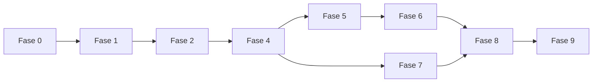

# Plan de Implementación Restante — Atenex Nova

Plataforma local de memoria documental y RAG de nueva generación. Este documento recoge el plan por fases que **queda por implementar** después de completar la base del proyecto. La **Fase 3 se omite expresamente** porque ya está resuelta en el estado actual del repositorio.

---

## Resumen Ejecutivo

Atenex Nova se construye como un **Modular Monolith + Local Engines** con arquitectura hexagonal y DDD liviano.

Tecnologías núcleo:
- **Backend:** Python 3.12 + FastAPI + SQLAlchemy/SQLModel + Alembic
- **Frontend:** Vite + React 19 + TypeScript
- **IA local:** Gemma 4, EmbeddingGemma, Docling, Qdrant, ColPali
- **Objetivo:** memoria documental local con múltiples motores de recuperación, trazabilidad y grounding real

### Estado general de fases
- **Fase 0**: completada o en curso como base documental y estructural
- **Fase 1**: fundación del repositorio y núcleo arquitectónico
- **Fase 2**: ingesta estructural
- **Fase 3**: memoria textual base, **ya completada y excluida de este plan**
- **Fases restantes**: 4, 5, 6, 7, 8 y 9

---

## Fase 0 — Planificación y Estructura

### Objetivo
Definir el repositorio, la documentación base y la estructura navegable para el desarrollo.

### Entregables
- `docs/plan.md`
- `docs/baseline.md`
- `AGENTS.md`
- `README.md`
- `.gitignore`
- Estructura inicial de `backend/`, `frontend/`, `docs/`, `prompts/`, `scripts/` y `tests/`
- `docker-compose.yml` base

### Criterio de salida
Repositorio documentado, navegable y preparado para desarrollo incremental.

---

## Fase 1 — Fundación del Repositorio y Núcleo Arquitectónico

### Objetivo
Tener un proyecto compilable con API arrancando, UI arrancando, persistencia base y contratos internos definidos.

### Backend

#### 1.1 Configuración del proyecto Python
- `backend/pyproject.toml` con dependencias de runtime y desarrollo
- `backend/ruff.toml` con line-length 100
- configuración de `mypy` en modo estricto

#### 1.2 Estructura de paquetes
- `presentation/`
- `application/`
- `domain/`
- `infrastructure/`
- `workers/`
- `evaluation/`
- `shared/`

#### 1.3 Base de datos inicial
- Alembic con soporte SQLite y PostgreSQL
- migración inicial para `collections`, `documents`, `jobs`
- máquina de estados de jobs: `pending` → `running` → `succeeded`/`failed`/`cancelled`

#### 1.4 Sistema de jobs base
- `JobRepository`
- `JobRunner`
- `BaseJob`
- dispatcher hacia handlers

#### 1.5 FastAPI app factory
- `main.py` con lifespan
- routers registrados
- CORS para frontend
- health check `/health`

#### 1.6 Dependency Injection
- factories para servicios y repositorios con `Depends`

### Frontend

#### 1.7 Inicialización React
- Vite + React 19 + TypeScript
- `react-router-dom`
- estado global con `zustand` o `@tanstack/react-query`
- strict mode activado

#### 1.8 Design system base
- `variables.css`
- `reset.css`
- `global.css`
- `animations.css`
- tema oscuro premium con acentos vibrantes

#### 1.9 Layout y routing base
- `AppShell`
- `Sidebar`
- `TopBar`
- pantallas stub: Dashboard, Collections, Documents, Query, Jobs

#### 1.10 API client base
- wrapper `fetch`
- tipos TypeScript para DTOs
- hook de health check

### Infraestructura

#### 1.11 Docker Compose
- `qdrant`
- `postgres` para perfil prod
- volúmenes persistentes

### Criterio de salida
- API arranca sin error
- UI arranca sin error
- `/health` responde `200`
- OpenAPI visible
- tablas iniciales creadas
- tests básicos pasan
- Ruff y mypy sin errores

---

## Fase 2 — Ingesta Estructural

### Objetivo
Convertir documentos heterogéneos en una estructura navegable y persistida.

### Tareas

#### 2.1 Upload de documentos
- `POST /collections/{id}/documents`
- `BlobStore` en `storage/uploads/{collection_id}/{doc_id}/`
- hash SHA-256 y MIME type
- registro con `status=registered`
- encolado de `parse_document`

#### 2.2 Integración Docling
- `DoclingParserAdapter`
- convertir salida a árbol de nodos internos
- preservar `page_number`, `order_index`, bounding boxes y relaciones estructurales

#### 2.3 Normalización
- `Normalizer`
- detección de idioma
- limpieza de whitespace
- preservación de numerales, fechas, códigos e IDs
- enlazado de elementos estructurales relacionados

#### 2.4 Almacenamiento de nodos
- tabla `document_nodes`
- `SqlDocumentNodeRepository`
- transición de estado `registered` → `parsed` → `normalized`

#### 2.5 Vista de árbol documental en UI
- `DocumentTree`
- `DocumentDetail`
- `DocumentTable`
- badges de estado

#### 2.6 Jobs de ingesta
- `ParseDocumentJobHandler`
- `NormalizeDocumentJobHandler`
- manejo explícito de errores con `Document.fail(reason)`

### Criterio de salida
- subida de documentos funcional
- Docling genera nodos persistidos
- árbol documental visible en UI
- estados del documento correctos

---

## Fase 4 — Memoria Enriquecida

### Objetivo
Construir memoria de nivel superior: proposiciones, resúmenes jerárquicos y relaciones semánticas.

### Tareas

#### 4.1 Extracción de proposiciones
- `PropositionExtractor`
- extraer hechos, definiciones, procedimientos, reglas y relaciones causales
- tabla `propositions`
- job `ExtractPropositionsJobHandler`

#### 4.2 Resúmenes jerárquicos
- `SummaryGenerator`
- resúmenes por sección, documento y colección
- tabla `summary_nodes`
- job `SummaryWorkerJobHandler`

#### 4.3 Índice de proposiciones
- colección Qdrant `propositions_dense`
- embeddings con EmbeddingGemma
- indexación de proposiciones

#### 4.4 Índice de resúmenes
- colección Qdrant `summaries_dense`
- embeddings con EmbeddingGemma
- indexación de resúmenes

#### 4.5 Grafo proposicional
- `GraphStore` SQL-based
- tabla `relation_edges`
- relaciones: `mentions`, `defines`, `supports`, `contradicts`, `elaborates`, `appears_in`
- `expand()` para recorrer el grafo desde semillas
- job `BuildGraphJobHandler`

#### 4.6 UI de memoria enriquecida
- `ChunkInspector`
- `PropositionGraphView`
- pestaña de proposiciones en `DocumentDetail`

### Criterio de salida
- proposiciones extraídas y almacenadas
- resúmenes jerárquicos generados
- índices de proposiciones y resúmenes operativos
- grafo proposicional consultable

---

## Fase 5 — Query Intelligence

### Objetivo
Routing automático de consultas, reducción de ruido contextual y preparación de evidence packs.

### Tareas

#### 5.1 Preprocesamiento de consulta
- `QueryNormalizer`
- `QueryLanguageDetector`
- `QueryFeatureExtractor`
- detección de nombres propios, fechas, comparaciones, contradicciones y referencias visuales

#### 5.2 Clasificación de intención
- `QueryIntentClassifier`
- intents: `exact`, `factual`, `comparative`, `explanatory`, `argumentative`, `global`, `visual`
- implementación inicial rule-based + similarity embeddings

#### 5.3 Query Router
- `QueryRouter`
- política por modo:
  - `exact` → sparse dominante + dense auxiliar
  - `factual_local` → dense + sparse + reranking
  - `multi_hop` → chunks + propositions + graph expansion
  - `global` → summaries + comunidades + DRIFT
  - `argumentative` → hybrid + support/contradict grouping
  - `visual` → ColPali + chunks textuales

#### 5.4 Query Expander
- expansión opcional de sinónimos
- subpreguntas para multi-hop
- HyDE opcional

#### 5.5 Evidence Pack Builder
- `ContextPackingPolicy`
- deduplicación semántica
- eliminación de distractores
- agrupación por documento/tema
- presupuesto de tokens
- candidatos de cita

#### 5.6 Reranking mejorado
- reranker liviano como primera capa
- late interaction cuando el hardware lo permita
- integración en `RetrievalOrchestrator`

#### 5.7 UI del router
- mostrar modo detectado, intención y ruta usada
- panel inferior con ruta, plan y evidencias excluidas

### Criterio de salida
- consultas clasificadas automáticamente
- modo de recuperación elegido de forma razonable
- evidence packs útiles y limpios
- reranking mejorando la calidad de resultados

---

## Fase 6 — Generación y Verificación

### Objetivo
Respuestas trazables con citas inline, verificación de grounding y persistencia formal.

### Tareas

#### 6.1 Runtime LLM
- `LlamaCppGeneratorAdapter`
- `OllamaGeneratorAdapter`
- soporte de streaming y parámetros de generación

#### 6.2 Answer Planner
- `AnswerPlanningPolicy`
- planes:
  - `direct_answer`
  - `hierarchical_synthesis`
  - `global_synthesis`
  - `argument_synthesis`
  - `visual_grounded_synthesis`

#### 6.3 Plantillas de prompts
- `DIRECT_ANSWER_PROMPT.md`
- `HIERARCHICAL_MAP_PROMPT.md`
- `HIERARCHICAL_REDUCE_PROMPT.md`
- `GLOBAL_SYNTHESIS_PROMPT.md`
- `ARGUMENT_SYNTHESIS_PROMPT.md`
- `VISUAL_GROUNDED_PROMPT.md`
- `VERIFICATION_PROMPT.md`

#### 6.4 Generación con Gemma 4
- `AnswerOrchestrator`
- construir prompt según plan
- invocar `Generator`
- parsear salida estructurada

#### 6.5 Verificación
- `Verifier`
- validación de citas y spans
- grounding score
- contradicciones sin resolver
- sobreafirmación
- segunda pasada o incertidumbre explícita si falla

#### 6.6 Citation Binding
- `CitationBinder`
- respuesta final con citas inline
- panel lateral de fuentes
- resaltados para visor documental

#### 6.7 Persistencia de respuestas
- tablas `answers` y `citations`
- `POST /queries/answer`
- `GET /answers/{id}`

#### 6.8 UI de respuesta
- `AnswerPanel`
- `CitationSidebar`
- `EvidenceCard`
- grounding score visible

### Criterio de salida
- Gemma 4 responde sobre evidence pack curado
- verificación de grounding activa
- citas inline funcionales
- respuestas persistidas
- UI de respuesta completa

---

## Fase 7 — Ruta Visual

### Objetivo
Resolver consultas sobre tablas, layouts complejos y documentos escaneados.

### Tareas

#### 7.1 Extracción de páginas complejas
- detección de páginas densas o escaneadas
- render PDF a imágenes
- almacenamiento en blob store

#### 7.2 Integración ColPali
- `ColPaliRetrieverAdapter`
- colección Qdrant `pages_visual`
- `upsert_pages()` y `query()` con late interaction visual

#### 7.3 Visual retrieval pipeline
- modo `visual` en `RetrievalOrchestrator`
- combinación de resultados visuales y textuales
- `VisualGroundedSynthesis`

#### 7.4 UI visual
- `PageViewer`
- resaltados sobre páginas
- integración dentro de `AnswerPanel`

### Criterio de salida
- ColPali indexa páginas complejas
- búsquedas visuales devuelven evidencia útil
- respuestas grounded visualmente
- UI muestra páginas con resaltado

---

## Fase 8 — Evaluación Formal

### Objetivo
Medir calidad, comparar perfiles y detectar regresiones.

### Tareas

#### 8.1 Golden sets
- `GoldenSetManager`
- datasets para exactas, multi-hop, globales, contradictorias y visuales

#### 8.2 Scoring retrieval
- `RetrievalScorer`
- métricas: Recall@k, MRR, nDCG, cobertura temática

#### 8.3 Scoring answering
- `AnswerScorer`
- grounding, relevancia, exactitud, contradicción y utilidad

#### 8.4 Regresión
- `RegressionComparator`
- comparación entre runs y versiones

#### 8.5 UI de evaluación
- `EvaluationReportView`
- endpoints de runs y reportes

### Criterio de salida
- golden sets definidos
- scoring automático activo
- comparador de regresión funcional
- tablero de evaluación operativo

---

## Fase 9 — Hardening Funcional

### Objetivo
Dejar el producto listo para uso repetible, robusto y documentado.

### Tareas

#### 9.1 Pulido de UI
- diseño responsivo
- estados vacíos, loading y error
- micro-animaciones
- modo visual coherente

#### 9.2 Tolerancia a fallos
- retry logic para jobs
- degradación elegante si Qdrant o LLM no están disponibles
- timeouts controlados

#### 9.3 Rebuilds de colección
- job `rebuild_collection`
- migración de perfiles de embedding

#### 9.4 Exportes
- exportar respuestas a Markdown/PDF
- exportar evidencia y citas

#### 9.5 Observabilidad
- logging por `query_id`, `job_id`, `document_id`
- métricas de jobs y grounding
- trazabilidad completa

#### 9.6 Documentación de operación
- guía de despliegue local
- guía de perfiles
- troubleshooting
- README actualizado

### Criterio de salida
- UI pulida
- sistema tolerante a fallos
- documentación de operación completa
- instalación repetible en un equipo nuevo

---

## Dependencias entre Fases

> Nota: la Fase 3 no aparece en este documento porque ya está completada en el estado actual del proyecto.

---

## Recomendaciones de Ejecución

1. Mantener `backend/` y `frontend/` sincronizados con contratos de API estables.
2. No introducir dependencias directas de infraestructura en la capa de dominio.
3. Priorizar primero el pipeline de memoria enriquecida y luego el routing de consultas.
4. Validar cada fase con tests y comprobaciones mínimas antes de pasar a la siguiente.

---

## Verificación por Fase

- `pytest tests/ -v` para backend
- `npm test` para frontend
- `ruff check .` para calidad Python
- `mypy .` para tipado estricto
- pruebas manuales de UI y salud del API en cada entrega
